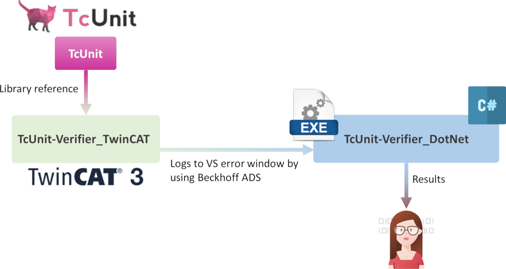

# TcUnit-Verifier

This project is can be used to verify the different functions of [TcUnit](https://www.github.com/tcunit/TcUnit).
It has various test suites to test different functions in TcUnit.
It consists of two separate programs:

- TcUnit-Verifier_TwinCAT
- TcUnit-Verifier_DotNet

When verifying that TcUnit works as expected a developer needs to add tests to both of these programs.



## TcUnit-Verifier_TwinCAT

TcUnit-Verifier_TwinCAT (TcVT) is as the name implies a TwinCAT project.
It holds a reference to and instantiates the TcUnit framework.
It is defined by several test suites (function blocks) that make use of TcUnit and its different functionalitites.
An example of a test is to verify that TcUnit prints a message if an assertion of an INT has failed (expected value not equals to asserted value).
This means per definition that the verifier will have failed tests as results, because that is what we want to test.
Everytime a test suite is created in TcVT that tests the functionality of TcUnit it is expected that either:

- Some specific output is created by TcUnit (error-log), for example asserting a value that differs from the expected value
- Some specific output is **not** created by TcUnit (error-log), for example asserting a value that is equal to the expected value

Creating a test suite for TcUnit thus requires that the developer needs to know what TcUnit should print (or not print).
This means that running this TwinCAT project is not enough to know whether TcUnit behaves as expected, as it would require to manually check all the output from TcVT.
Because we don't manually want to check that the output provided by TcUnit-Verifier_TwinCAT everytime it's running, another program is necessary that verifies that the output of the TcVT is as expected.

## TcUnit-Verifier_DotNet

The TcUnit-Verifier_DotNet (TcVD) is a C# program that opens and runs the TcUnit-Verifier_TwinCAT project by the usage of the TwinCAT automation interface.
It basically does the following:

- Starts Visual Studio (using the same version that was used developing TcVT)
- Opens TcVT
- Does a clean/build of TcVT
- Generates a boot project for TcVT on local machine
- Activates TcVT on local machine
- Restarts TwinCAT on local machine
- Waits for all tests in TcVT to be finished
- Collects all results from the error list in Visual Studio
- Checks that the output is as defined/expected

The different tests in TcVD follow the same naming-schema as for the TcVT tests, so for example you can find a structured text (ST) function block (FB) `FB_PrimitiveTypes.TcPOU` in TcVT and the accompanying C#-class `FB_PrimitiveTypes.cs`.
The C# classes verify and test that the output from the ST function blocks is correct.
Thus a complete test of a specific function in TcUnit needs to be developed in pair, both a FB of tests needs to be added to TcVT as well a class of tests needs to be added to TcVD.

All test classes are instantiated in the class `Program.cs` starting from the lines:

```csharp
// Insert the test classes here
new FB_PrimitiveTypes(errors);
new FB_AssertTrueFalse(errors);
new FB_AssertEveryFailedTestTwice(errors);
...
...
...
```

To create a new test class and make sure that it will be running all that is necessary is to make sure to instantiate it with the argument `errors` (just as above).
If you have added a test in TcVT that is supposed to fail, and thus adding an additional failed test to the output, you need to increment the variable `expectedNumberOfFailedTests` in TcVD by one for every failed test that you have added.

For example, if we in the PRG_TEST-program of TcVT have a function block instantiated in this way:

```structuredtext

PROGRAM PRG_TEST
VAR
    AssertEveryFailedTestTwiceArrayVersion : FB_AssertEveryFailedTestTwiceArrayVersion;
END_VAR
```

The equivalent test class in TcVD needs to be instantiated in the following way:

```csharp
new FB_AssertEveryFailedTestTwiceArrayVersion(errors);
```

This is an example of how it can look running the TcUnit-Verifier_DotNet:

```cmd
C:\Code\GitHub_TcUnit\TcUnit\TcUnit-Verifier\TcUnit-Verifier_DotNet\TcUnit-Verifier\bin\Debug>TcUnit-Verifier.exe -v "C:\Code\GitHub_TcUnit\TcUnit\TcUnit-Verifier\TcUnit-Verifier_TwinCAT\TcUnit-Verifier_TwinCAT.sln"
2023-11-27 20:56:27 [INFO ] - Starting TcUnit-Verifier...
2023-11-27 20:56:27 [INFO ] - In Visual Studio solution file, found visual studio version 16.0
2023-11-27 20:56:27 [INFO ] - Loading the Visual Studio Development Tools Environment (DTE)...
2023-11-27 20:56:34 [INFO ] - Cleaning and building TcUnit-Verifier_TwinCAT solution...
2023-11-27 20:56:34 [INFO ] - Generating TcUnit-Verifier_TwinCAT boot project...
2023-11-27 20:56:48 [INFO ] - Activating TcUnit-Verifier_TwinCAT configuration...
2023-11-27 20:56:51 [INFO ] - Restarting TwinCAT...
2023-11-27 20:56:51 [INFO ] - Waiting for TcUnit-Verifier_TwinCAT to finish running tests...
2023-11-27 20:57:01 [INFO ] - ... got 376 report lines so far.
2023-11-27 20:57:12 [INFO ] - ... got 901 report lines so far.
2023-11-27 20:57:23 [INFO ] - ... got 1392 report lines so far.
2023-11-27 20:57:24 [INFO ] - Asserting results...
2023-11-27 20:57:25 [INFO ] - Done.
2023-11-27 20:57:25 [INFO ] - Closing the Visual Studio Development Tools Environment (DTE), please wait...
2023-11-27 20:57:45 [INFO ] - Exiting application...
```

If there was an error in the TcUnit framework this would be shown between the lines `Asserting results...` and `Done.`.
If nothing is shown between these lines (like in the example) it means that TcUnit behaves according to the tests defined in TcUnit-Verifier.
As TcVD starts the TwinCAT runtime it is required  that a (trial) runtime license for TwinCAT is activated on the PC of where TcVD and TcVT will be running.