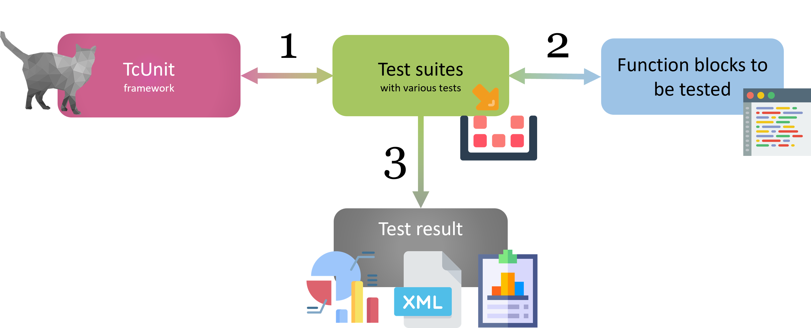

  

> TcUnit is an [xUnit](https://en.wikipedia.org/wiki/XUnit) type of framework specifically done for [Beckhoff's TwinCAT 3](https://www.beckhoff.com/en-en/products/automation/twincat/) development environment.
It consists of a single library that is easily integrated into any existing TwinCAT 3 project.

**Want to get started?**  
Start by reading the [unit testing concepts](unit-testing-concepts.md) and then the [introduction user guide](introduction-user-guide.md).

**Easy to use**  
The framework is easy to use.
All that is needed is to download & install the library, and provide a reference to the TcUnit-library in your project, and you can start to write your test code.
For a complete set of instructions, start with [the concepts](unit-testing-concepts.md), continue with [the user guide](introduction-user-guide.md) and finish with [the programming example](programming-example-introduction.md).

**One library**  
All functionality is provided by one single library.
Add the library to your project and you are ready to go! You can either [download a precompiled](https://github.com/tcunit/TcUnit/releases) (ready to install) version of the library or [download the source code](https://www.github.com/tcunit/tcunit).

**MIT-license**  
The library and all the source code is licensed according to the MIT-license, which is one of the most relaxed software license terms.
The software is completely free and you can use the software in any way you want, be it private or for commercial use as long as you include the MIT license terms with your software.

**Automated test runs**  
With the additional TcUnit-Runner software, it's possible to do integrate all your TcUnit tests into a CI/CD software toolchain.
With the aid of automation software such as [Jenkins](https://www.jenkins.io/) or [Azure DevOps](https://azure.microsoft.com/en-us/services/devops/), you can have your tests being run automatically and collect test statistics every time something is changed in your software version control (such as Git or Subversion).
