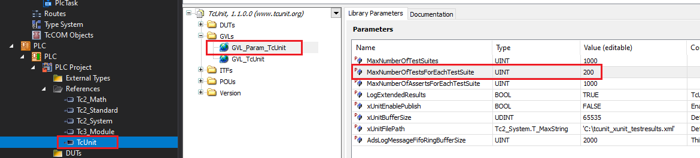
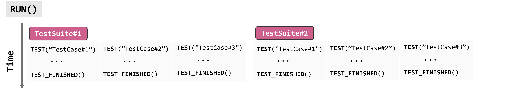
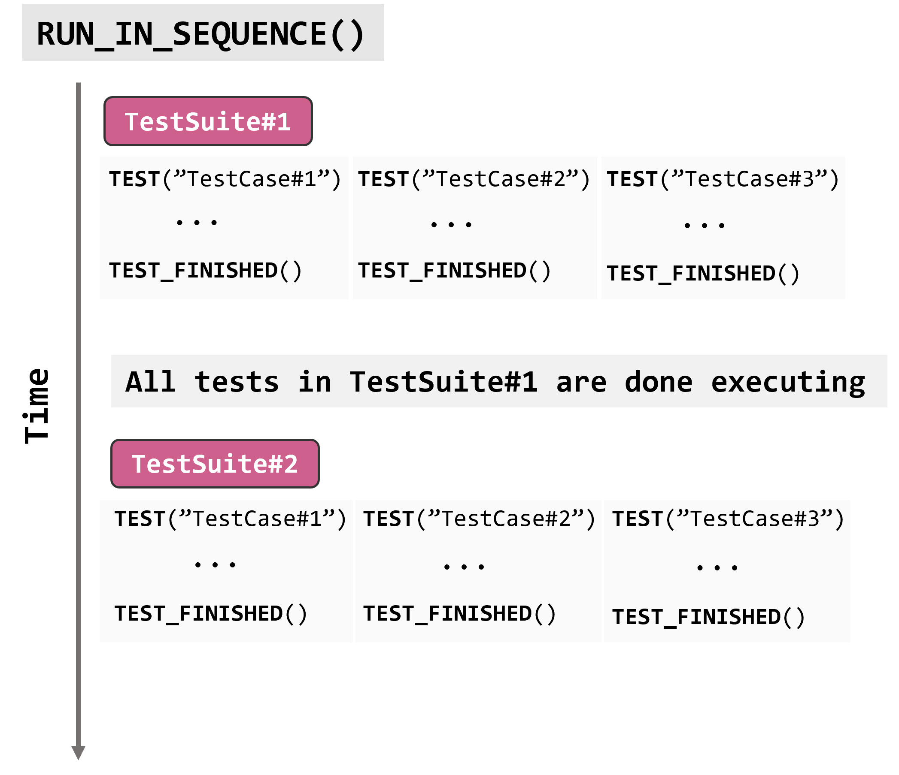
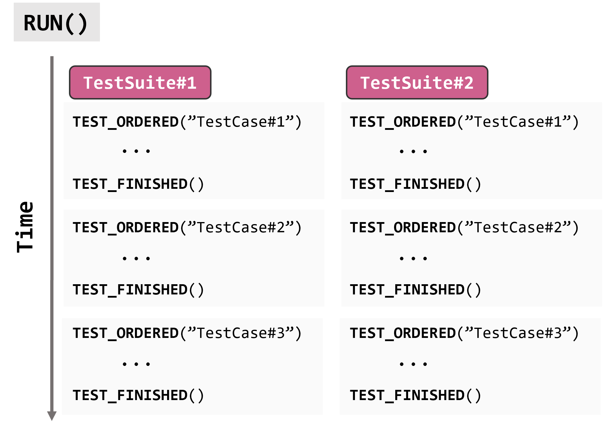
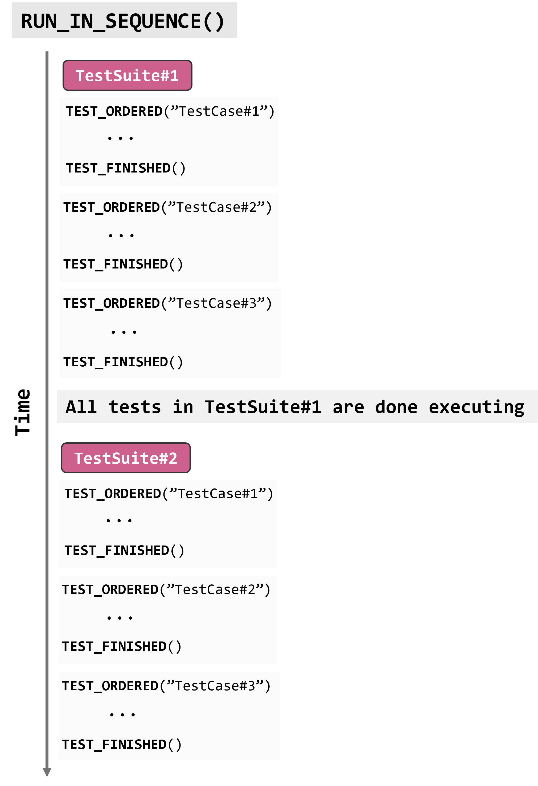
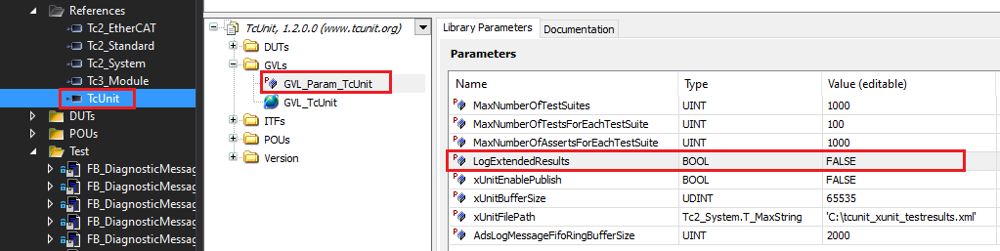
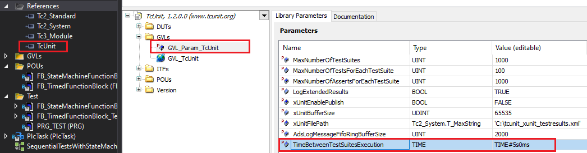
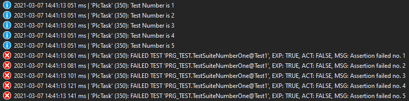
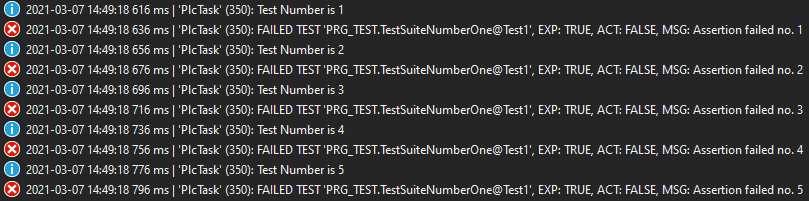
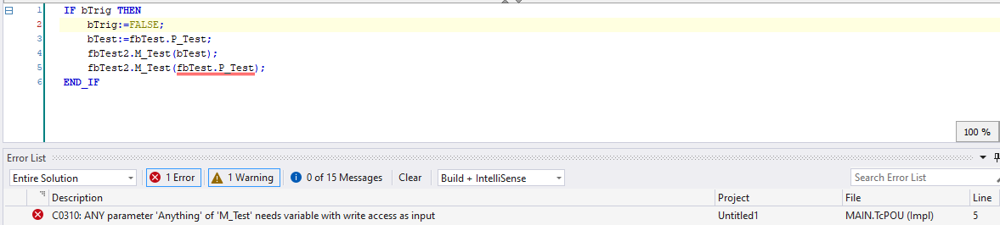

# Frequently asked questions

<p align="center">
  
</p>

Here you'll find the most commonly asked questions and their answers.
If you don’t find what you are looking for here, you can look through the:

- [Open](https://github.com/tcunit/TcUnit/issues?q=is%3Aopen+is%3Aissue) and [closed](https://github.com/tcunit/TcUnit/issues?q=is%3Aissue+is%3Aclosed) issues on GitHub
- [Discussions](https://github.com/tcunit/TcUnit/discussions) on GitHub

---

1. [How can I run a test across multiple PLC cycles?](#_1-how-can-i-run-a-test-across-multiple-plc-cycles)  
2. [How can I disable/ignore a test?](#_2-how-can-i-disableignore-a-test)  
3. [Is there a way to test %I* or %Q* variables?](#_3-is-there-a-way-to-test-i-or-q-variables)  
4. [Is there a way to hide TcUnit in my libraries?](#_4-is-there-a-way-to-hide-tcunit-in-my-libraries)  
5. [How do I do assertions on the BIT datatype?](#_5-how-do-i-do-assertions-on-the-bit-datatype)  
6. [When I run more than 100 tests in a single test-suite I get the wrong results, why?](#_6-when-i-run-more-than-100-tests-in-a-single-test-suite-i-get-the-wrong-results-why)  
7. [Is it possible to run test suites and/or tests in a sequence?](#_7-is-it-possible-to-run-test-suites-andor-tests-in-a-sequence)  
8. [Why is it taking so long to get the results from TcUnit?](#_8-why-is-it-taking-so-long-to-get-the-results-from-tcunit)  
9. [Is it possible to have a time delay between the execution of the test suites?](#_9-is-it-possible-to-have-a-time-delay-between-the-execution-of-the-test-suites)  
10. [If I call ADSLOGSTR(), my messages don't show up in the correct sequence. Why?](#_10-if-i-call-adslogstr-my-messages-dont-show-up-in-the-correct-sequence-why)  
11. [How do I test functions?](#_11-how-do-i-test-functions)  
12. [I have problems running TcUnit on a ARMv7 controller, why?](#_12-i-have-problems-running-tcunit-on-a-armv7-controller-why)  
13. [AssertEquals(ANY) on properties makes my development environment crash, why?](#_13-assertequalsany-on-properties-makes-my-development-environment-crash-why)

---

## 1. How can I run a test across multiple PLC cycles?

This can be accomplished by keeping the function block under test as an instance variable of the test method, using `VAR_INST`.
For example:

```example
METHOD PRIVATE MyTest
VAR_INST
    fbTestTimer : TON := (PT := T#5S);
    fbToBeTested : FB_ToBeTested;
END_VAR
-------
TEST('MyTest')
fbTestTimer(IN := TRUE);

// Do stuff here with fbToBeTested

IF fbTestTimer.Q THEN
    // Make your assertions here or part of the test execution as a state machine
    TEST_FINISHED();
END_IF
```

In this example, the `FB_ToBeTested` is instantiated under the test suite as an instance variable in the test-method, and can thus be controlled over multiple cycles.
Then all that's necessary to do is to set the condition for when the assertion should be made in the test itself, which in the example is when the `fbTestTimer` has elapsed (`fbTestTimer.Q`).
Note that you don't have to use a timer, this is just an example.
You can for example also use a state-machine that steps over various tests over multiple cycles instead.

**Required TcUnit version:** 1.0 or later

## 2. How can I disable/ignore a test?

Add `DISABLED_` in front of the test name, for example:

```body
TEST('DISABLED_ThisTestWillBeIgnored');
 
AssertEquals(Expected := a,
             Actual := b,
             Message := 'A does not equal B');
 
TEST_FINISHED();
```

**Required TcUnit version:** 1.0 or later

## 3. Is there a way to test `%I*` or `%Q*` variables?

In a number of scenarios, TwinCAT won't let you write directly to certain variables:

- Due to access restrictions (e.g. a variable in a FB's VAR)
- The variable being set as I/O (i.e. `AT %I*` or `AT %Q*`)

Writing to these variables wouldn’t make sense and should be prevented in the normal PLC code, so having special privileges during testing is a must.
To support these cases, TcUnit provides helper functions like `WRITE_PROTECTED_BOOL()`, `WRITE_PROTECTED_INT()` (and so forth) for setting these type of variables.
For an example of how to use these, let's assume you have a test:

```declaration
METHOD PRIVATE TestCommsOkChannelsLow
VAR
    EL1008 : FB_Beckhoff_EL1008;
END_VAR
```

Where the `FB_Beckhoff_EL1008` holds a variable:

```body
iChannelInput AT %I* : ARRAY[1..8] OF BOOL;
```

Now you might want to write a value to the first channel of the iChannelInput like:

```body
TcUnit.WRITE_PROTECTED_BOOL(Ptr := ADR(EL1008.iChannelInput[1]),
                            Value := FALSE);
```

Whereas afterwards you can make an assertion as usual:

```body
AssertFalse(Condition := EL1008.ChannelInput[1],
            Message := 'Channel is not false');
```

**Required TcUnit version:** 1.0 or later

## 4. Is there a way to hide TcUnit in my libraries?

You can accomplish this by the [Hide reference](https://infosys.beckhoff.com/english.php?content=../content/1033/tc3_plc_intro/18014402725266443.html&id=) option for referenced libraries.
This option lets you hide TcUnit from your other projects.
Let’s assume you’ve developed a library `MyLibrary`, which has tests written in TcUnit.
You make a PLC project MyProject, which references MyLibrary.

If you use **Hide reference** on TcUnit in `MyLibrary`, then TcUnit won't show up in the imports list of `MyProject`.
You can find it in the Properties tab:


**Required TcUnit version:** 1.0 or later

## 5. How do I do assertions on the BIT datatype?

I want to do an assertion on two variables both declared with the `BIT`-datatype, but I have noticed that a `AssertEquals_BIT()` does not exist.
What do I do?

The reason a `AssertEquals_BIT()` does not exist is that TwinCAT does not allow a BIT-datatype as a variable input.
If you have data declared with the BIT-type, the easiest way to do an assertion on these is to do a `BIT_TO_BOOL()` conversion and use the `AssertEquals_BOOL()`.

```body
TEST('Testing_of_BIT_Type');
 
AssertEquals_BOOL(Expected := BIT_TO_BOO(VariableDeclaredAsBit_A),
                  Actual := BIT_TO_BOOL(VariableDeclaredAsBit_B),
                  Message := 'The variables differ');
 
TEST_FINISHED();
```

**Required TcUnit version:** 1.0 or later

## 6. When I run more than 100 tests in a single test-suite I get the wrong results, why?

When TcUnit is running it allocates memory in the PLC to store the test results.
The maximum number of tests for every test suite has been set to 100, which however is a configuration parameter for TcUnit and can be changed.
Parameters for TcUnit (and in fact any library references) are stored in your project, which means that this change will be persistent for your project/library.
To change this max amount, to say for instance 200 tests per test suite, go to the library references and select TcUnit, then go to `GVLs` → `GVL_Param_TcUnit` → `MaxNumberOfTestsForEachTestSuite`.



**Required TcUnit version:** 1.0 or later

## 7. Is it possible to run test suites and/or tests in a sequence?

Yes.
By default TcUnit runs all the test suites and tests in parallel, in other words all test suites and tests are run at the same time.
Sometimes it is however desirable to run either the test suites or tests (or both) in a sequence, for example if you get exceed overruns while running tests.
Since TcUnit 1.2 it's possible to run test suites in sequence (one after another) and/or individual tests in order (one after another).

To execute test suites in a sequence, simply replace `TcUnit.RUN()` with `TcUnit.RUN_IN_SEQUENCE()` in your main body of the test program.
This will execute the test suites in the order that they were declared.
So for example if we have defined the following test suites and test program:

```example
PROGRAM PRG_TEST
VAR 
    fbDiagnosticMessageDiagnosticCodeParser_Test : FB_DiagnosticMessageDiagnosticCodeParser_Test;
    fbDiagnosticMessageFlagsParser_Test : FB_DiagnosticMessageFlagsParser_Test;
    fbDiagnosticMessageParser_Test : FB_DiagnosticMessageParser_Test;
END_VAR
-------------------------
TcUnit.RUN_IN_SEQUENCE();

```

This will first execute all tests defined in `fbDiagnosticMessageDiagnosticCodeParser_Test`, once all tests are finished in that function block, TcUnit will execute all tests in `fbDiagnosticMessageFlagsParser_Test`, and when that is done it will execute all tests in `fbDiagnosticMessageParser_Test`.

It's also possible to execute individual tests in order by simply replacing `TEST('TestName')` with `TEST_ORDERED('TestName')`.
This will execute the tests in the order that the `TEST_ORDERED()` is called for the various tests.
`TEST_ORDERED()` returns a boolean to indicate whether the TcUnit framework will run the test, so in order to only execute the code when it's time for that particular test, it makes sense to check if `TEST_ORDERED()` returns true, and only then do the execution of the function blocks and assertions, for example like this:

```example
METHOD PRIVATE TestWithTimestampZeroTimeExpectCurrentTime
VAR
   ... (variable declaration used for the test)
END_VAR
------------------------------------------------------------------
IF TEST_ORDERED('TestWithTimestampZeroTimeExpectCurrentTime') THEN
    fbFunctionBlockUnderTest(Parameters);
 
    AssertEquals(Expected := 'SomeValue',
                 Actual := fbFunctionBlockUnderTest.OutVariable,
                 Message := 'Test failed');
 
    TEST_FINISHED();
END_IF
```

As usual, the `TEST_FINISHED()` will indicate that this test is finished, and the framework will go to the next test.
Note that you don't need to create any state machine for calling the different `TEST_ORDERED()` tests.
You can (and must!) call all `TEST_ORDERED()` at the same time.
The framework will make sure to only care about the assertions of the test that is currently running.

This means the following combinations can be used:

- `RUN()` with all tests as `TEST()` – means all tests suites and tests will run in parallel, this is the default behaviour.  

- `RUN_IN_SEQUENCE()` with all tests as `TEST()` – means all test suites will run in sequence, but the tests in every test suite will run in parallel.  

- `RUN()` with all tests as `TEST_ORDERED()` – means all test suites will run in parallel, but the tests in every test suite will run in sequence.  

- `RUN_IN_SEQUENCE()` with all tests as `TEST_ORDERED()` – means all test suites will run in sequence, as will every test.  


For maximum flexibility, these combinations are allowed as well for special occasions:

- `TcUnit.RUN()` with mixed tests of `TEST()` and `TEST_ORDERED()`– means all tests suites will run in parallel, with tests marked as `TEST()` run in parallel with tests that are marked with `TEST_ORDERED()` that run in sequence (relative to each other)
- `TcUnit.RUN_IN_SEQUENCE()` with mixed tests of `TEST()` and `TEST_ORDERED()` – means all test suites will run in sequence, with tests marked as `TEST()` run in parallel with tests that are marked with `TEST_ORDERED()` that run in sequence (relative to each other)

If you run tests with both `TEST()` and `TEST_ORDERED()`, all tests defined with `TEST()` will run in parallel with the tests that are `TEST_ORDERED()`.

Note that you can't execute test-suites with both `TcUnit.RUN()` and `TcUnit.RUN_IN_SEQUENCE()` at the same time (which wouldn't make any sense).

For a couple of TwinCAT projects that shows how to run both test suites in a sequence and individual tests in order, click [here](https://github.com/tcunit/ExampleProjects/tree/master/RunTestsInSequenceExampleProjects).

**Required TcUnit version:** 1.2 or later

## 8. Why is it taking so long to get the results from TcUnit?

If you have many test suites and/or tests, it can take some time for TcUnit to print all those results.
Since version 1.1 of TcUnit, much more data is printed to the ADS-logger as this data is used for the communication with TcUnit-Runner.
If you know that you will only run your tests locally and without integration to a CI/CD tool using TcUnit-Runner, you can set the parameter `LogExtendedResults` to `FALSE` (it is default `TRUE`).
To change this parameter, go to the library references and select TcUnit, then go to `GVLs` → `GVL_Param_TcUnit` → `LogExtendedResults`.  



**Required TcUnit version:** 1.1 or later

## 9. Is it possible to have a time delay between the execution of the test suites?

Yes.
You can set the parameter `TimeBetweenTestSuitesExecution` to whatever delay you want to have.
To change this parameter, go to the library references and select TcUnit, then go to `GVLs` → `GVL_Param_TcUnit` → `TimeBetweenTestSuitesExecution`.
Default this parameter is set to `T#0S` (zero seconds, i.e. no delay).
For example, in the below screenshot this is changed to 5 seconds.  



**Required TcUnit version:** 1.2 or later

## 10. If I call ADSLOGSTR(), my messages don't show up in the correct sequence. Why?

If I call `Tc2_System.ADSLOGSTR()` during execution of a test, my messages don't arrive in the expected order.
Let's for example assume this very simple (always failing) test:

```body
TEST('Test1');
FOR nCounter := 1 TO 5 BY 1 DO
    Tc2_System.ADSLOGSTR(msgCtrlMask := ADSLOG_MSGTYPE_HINT, 
                         msgFmtStr := 'Test Number is %s', 
                         strArg := INT_TO_STRING(nCounter));
 
    sAssertionMessage := Tc2_Standard.CONCAT(STR1 := 'Assertion failed no. ', STR2 := INT_TO_STRING(nCounter));
 
    AssertEquals_BOOL(Expected := TRUE,
                      Actual := FALSE,
                      Message := sAssertionMessage);
END_FOR
TEST_FINISHED();
```

This will result in this order of messages:



I want the messages to arrive in the correct order, how is this achieved?

The reason for this behavior is because all ADS messages that TcUnit creates/outputs are buffered (for deeper technical description [read this](https://github.com/tcunit/TcUnit/issues/35)).
If `Tc2_System.ADSLOGSTR()` is used directly, the messages can come out of sequence in relation to the message created by TcUnit as TcUnit buffers the messages to not overflow the ADS message router.

The solution is to use `TCUNIT_ADSLOGSTR()`, which accepts the exact same inputs as `ADSLOGSTR()`.
By using this function, the `ADSLOGSTR()` messages are put in the same buffer as TcUnit is using for its output.

So if we replaced the call to `Tc2_System.ADSLOGSTR()` to `TCUNIT_ADSLOGSTR()` instead, we get this:



**Required TcUnit version:** 1.2 or later

## 11. How do I test functions?

It's done almost identical as in the introduction user guide, but simply replace the instance of the function block that you want to test with the call to the function instead.
Assume we have a function:

```example
FUNCTION F_Sum
VAR_INPUT
    one : UINT;
    two : UINT;
END_VAR
-------
F_Sum := one + two;
```

Then the test would look like following:

```example
METHOD TwoPlusTwoEqualsFour
VAR
    Result : UINT;
    ExpectedSum : UINT := 4;
END_VAR
-------
TEST('TwoPlusTwoEqualsFour');
 
Result := F_Sum(one := 2, two := 2);
 
AssertEquals(Expected := ExpectedSum,
             Actual := Result,
             Message := 'The calculation is not correct');
 
TEST_FINISHED();
```

**Required TcUnit version:** 1.0 or later

## 12. I have problems running TcUnit on a ARMv7 controller, why?

When running TcUnit with a controller using ARMv7 you can run into issues, such as breakpoints not working.
This seems to be an issue with the limited memory of the controllers using an ARMv7 such as the CX8190 and CX9020. Please adjust the [parameters related to memory allocation](#6-when-i-run-more-than-100-tests-in-a-single-test-suite-i-get-the-wrong-results-why).

For more information on a set of working parameters, see [this issue on GitHub](https://github.com/tcunit/TcUnit/issues/148).

## 13. AssertEquals(ANY) on properties makes my development environment crash, why?

Asserting the expected value of a property makes TcXaeShell crash and triggers a Windows Blue-Screen-Of-Death causing a full PLC reboot.
What should I do?

Using [`AssertEquals(ANY)`](api.md#assertequals) on a property is not allowed.
In TwinCAT 4024 (and earlier) the compiler doesn't warn about this but simply crashes. In TwinCAT 4026 (and later) a compile error is raised, see the following screenshot:



Simply use the primitive variant of Assert instead. For example, if you have a parameter that is a boolean, use [`AssertEquals_BOOL`](api.md#assertequals_bool) instead.
