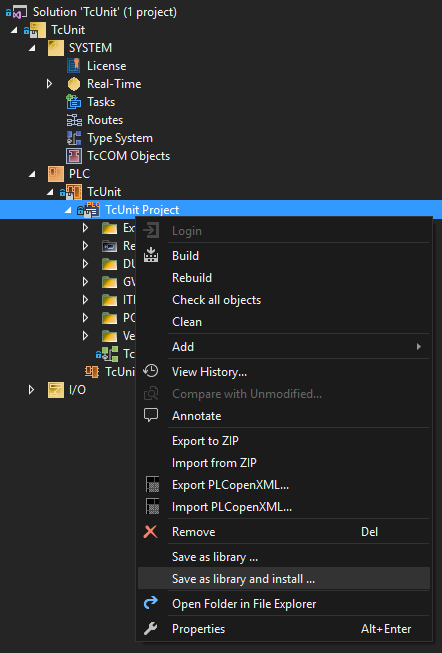
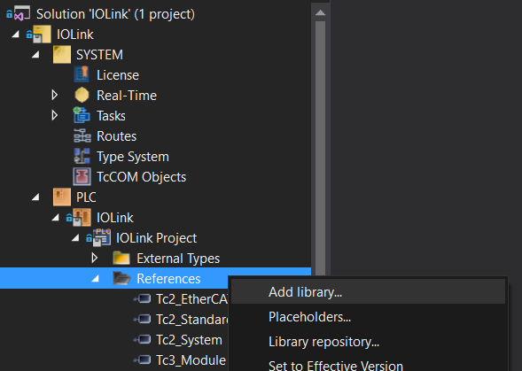
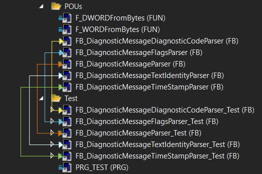
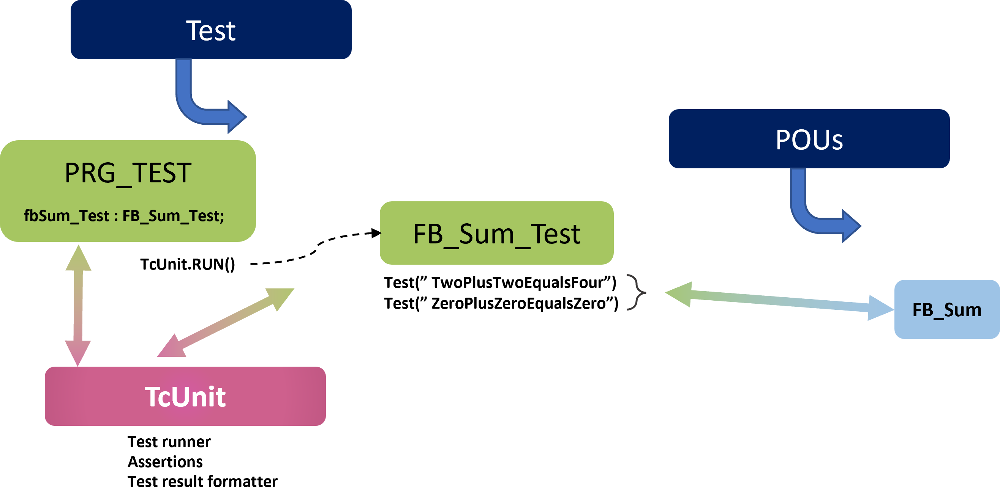
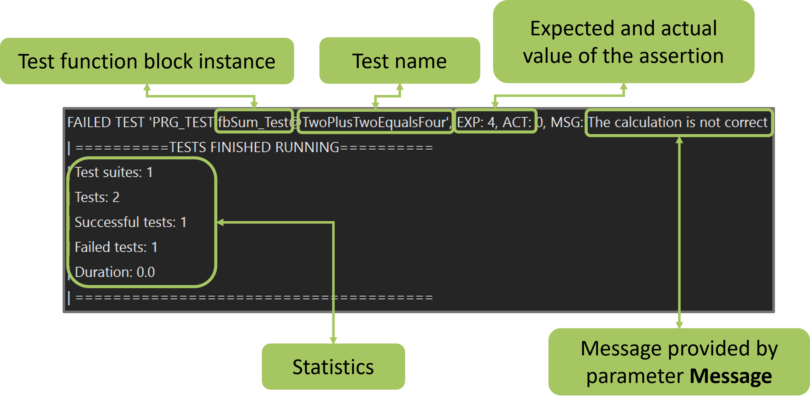
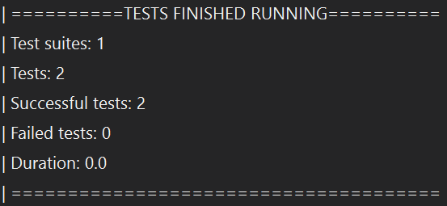
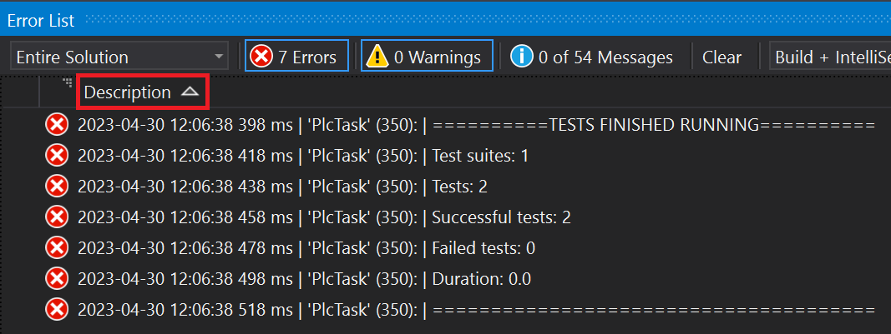

# Introduction user guide
Before reading this guide, it’s highly recommended to read [unit testing concepts](unit-testing-concepts.md), in order to have a basic understanding of the concepts of unit testing and TcUnit.

The TcUnit framework gives you the possibility to easily write unit tests for your TwinCAT 3 software, and having the results reported in a human-readable format for review.
All unit test code is written in the same program/library as the rest of your code, but because it is only used in a separate test-program, it does not affect the production code/executables.
With unit test-code provided with the rest of the code, you can see these additions as living documentation of the code.
For a more thorough/detailed example please see the [programming example](programming-example-part1-introduction.md).

The purpose of this user guide is to be a short tutorial where we will go through the different steps to that are necessary to use TcUnit, which are:

1. Download and install the TcUnit framework on your engineering PC
2. Reference the library in your project
3. Create test suites and run the tests

## Download & install
The framework can either be downloaded as a [precompiled library](https://github.com/tcunit/TcUnit/releases), or you can download the [source code](https://www.github.com/TcUnit/TcUnit) and compile the library yourself.

### Install from library file
If you’ve downloaded the library, you should have a file called **TcUnit.library** in your computer.
Start your TwinCAT XAE (Visual Studio).
In the menu of Visual Studio select **PLC** and then **Library Repository...**
This will display the following window:


Click on **Install...**, locate the **TcUnit.library** file and double-click on it.
Now it will install to your TwinCAT-folder, more specifically C:\TwinCAT\3.1\Components\Plc\Managed Libraries\www.tcunit.org\TcUnit\.

### Install from source
If you want to install it from source, make sure that you have a TwinCAT XAE installed.
Next do a GIT-clone on the repository.
Open the folder where you cloned the repo, and open the solution by double-clicking on the TcUnit.sln file in the root of the folder, which will open the project in your TwinCAT XAE environment.
In the solution explorer, locate the node **TcUnit Project** and right-click on it, select **Save as library and install...**



Select the desktop of your computer for where to save the file.
Make sure that the **file format** drop-down menu is set to **Library files (*.library)** and click on **Save**.
This will install the library on your computer.
Once the library is installed, the file that you saved on the desktop can be removed.

### Reference the library in project
In order to use TcUnit you need to add a reference to the library in your project.
Open your TwinCAT project, and right-click on the **References** under the PLC-project and click on **Add library...**



Next go to the TcUnit-group, select TcUnit and click **OK**.

### Create test suites and run them
For every function block (or free function) that you have defined we want to create a test function block (test suite), which has the responsibility to:

- Instantiate the FB under test
- Define the inputs
- Define the expected outputs (result)
- Call the TcUnit-assert methods to compare the expected output to the actual output for every test
It’s entirely up to the user how to to organize the different tests, so what follows is a best practice/suggestion.
On the same level as the `POUs` folder, create a folder called `Test`.
It’s in this folder that we will create all our test FBs as well as the program that will run the TcUnit framework.



In this example we have a total of five FBs.
For every FB we have created a test-FB, i.e. for `FB_DiagnosticMessageDiagnosticCodeParser` we have `FB_DiagnosticMessageDiagnosticCodeParser_Test`.
Note that the framework in no way enforces to use any standard for the naming, this is entirely up to the user.
For various reasons you might find it’s not even possible to add the test-FBs in the same solution (for instance, if this is your main executable), and in this case just put the tests in a separate solution and include the main solution in the test solution as a library.
Generally it’s better to structure the code in various library projects each responsible for a certain set of requirements/functionality.
It’s important to see the tests as an important part of your code.


The general structure here is that `PRG_TEST` is the program in where the test-FBs (test suites) are instantiated.
Each test suite is responsible of testing one FB or function, and can have one or more tests to do so.

Let’s assume we want to create the simplest possible FB that takes two unsigned integers and sums them.
We can create the header for the FB, but the actual implementation can (and should) wait after we’ve done the unit tests.

```
FUNCTION_BLOCK FB_Sum
VAR_INPUT
    one : UINT;
    two : UINT;
END_VAR
VAR_OUTPUT
    result : UINT;
END_VAR
```

Now let’s create the test suite for this.
This FB needs to extend `TcUnit.FB_TestSuite`.

```
FUNCTION_BLOCK FB_Sum_Test EXTENDS TcUnit.FB_TestSuite
VAR
END_VAR
```

By always adding this code, your test suite gets access to TcUnit and TcUnit will have a handle to your test suites.

Now it’s time to create our tests.
There are many ways to structure your tests, and there are several guidelines for this as well.
What we’ll be doing is to create a method for every test, and name it in such a way that it’s clear what the test does.
Remember that the unit tests are part of the documentation of your code, and although you might find the code trivial at this moment, there might be other developers reading your code now (or many years in the future).
For them well-named tests are invaluable.
We’ll be creating two tests called `TwoPlusTwoEqualsFour` and `ZeroPlusZeroEqualsZero`.
The `TwoPlusTwoEqualsFour` will look like this:

```
METHOD TwoPlusTwoEqualsFour
VAR
    Sum : FB_Sum;
    Result : UINT;
    ExpectedSum : UINT := 4;
END_VAR
-----------------------------
TEST('TwoPlusTwoEqualsFour');
 
Sum(one := 2, two := 2, result => Result);
 
AssertEquals(Expected := ExpectedSum,
             Actual := Result,
             Message := 'The calculation is not correct');
 
TEST_FINISHED();
```

By calling `TEST()` we tell TcUnit that everything that follows is a test.
Remember that we did `EXTENDS FB_TestSuite` in our test-suite?
This gives us access to assert-methods to check for all the data types available in IEC61131-3, including the ANY-type.
The Message parameter is optional and is used in case the assertion fails, the text is appended to the error output.
We finish the method by calling `TEST_FINISHED()`.
This gives the flexibility to have tests that span over more than one PLC-cycle.

For `ZeroPlusZeroEqualsZero` it’s more or less the same code.

```
METHOD ZeroPlusZeroEqualsZero
VAR
    Sum : FB_Sum;
    Result : UINT;
    ExpectedSum : UINT := 0;
END_VAR
--------------------------------
TEST('ZeroPlusZeroEqualsZero');
 
Sum(one := 0, two := 0, result => Result);
 
AssertEquals(Expected := ExpectedSum,
             Actual := Result,
             Message := 'The calculation is not correct');
 
TEST_FINISHED();
```

Next we need to update the body of the test suite (`FB_Sum_Test`) to make sure these two tests are being run.
```
TwoPlusTwoEqualsFour();
ZeroPlusZeroEqualsZero();
```

Last but not least, we need to have a program `PRG_TEST` defined in a task that we can run locally on our engineering PC.
Note that this program is only created to run the unit-tests, but will never be run on the target PLC.
Being part of the library project we only want a convenient way to test all the FBs part of our library, and thus need this program to execute the test suites.

`PRG_TEST` needs to instantiate all the test suites, and only execute one line of code.
In this case we only have one test suite.

```
PROGRAM PRG_TEST
VAR
    fbSum_Test : FB_Sum_Test; // This is our test suite
END_VAR
-----------------
TcUnit.RUN();
```

What we have now is this:



Activating this solution and running it results in the following result in the visual studio error list:



There is one test that has failed, and the reason for this is that we have not written the implementation code yet, only the header of the function block FB_Sum.
But how come that we have one test succeeding?
As we can see, the test `TwoPlusTwoEqualsFour` failed, which means that the one that succeeded was the other test `ZeroPlusZeroEqualsZero`.
The reason this succeeds is that the default return value for an output-parameter is zero, and thus it means that even if we haven’t written the body of `FB_Sum` the test will succeed.
Let’s finish by implementing the body of `FB_Sum`.

```
FUNCTION_BLOCK FB_Sum
VAR_INPUT
    one : UINT;
    two : UINT;
END_VAR
VAR_OUTPUT
    result : UINT;
END_VAR
----------------------
result := one + two;
```

Running the tests again we get the expected behavior:



If your output does not seem to be correctly formatted, it might be because Visual Studio is not sorting the output correctly.
Press on the **Description column** until there is an arrow pointing up, such as (see marking in red):



Obviously this is a very simple example and the purpose of this was to show how to use the framework rather to come up with a real-world example.
Simple functionality that does not require any state would be better suited to be implemented as a function, or in this case just using the "+" operator.
For a real-world example see the [programming example](programming-example-part1-introduction.md).

The source code for this example is [available on GitHub](https://github.com/tcunit/ExampleProjects/tree/master/SimpleExampleProject).