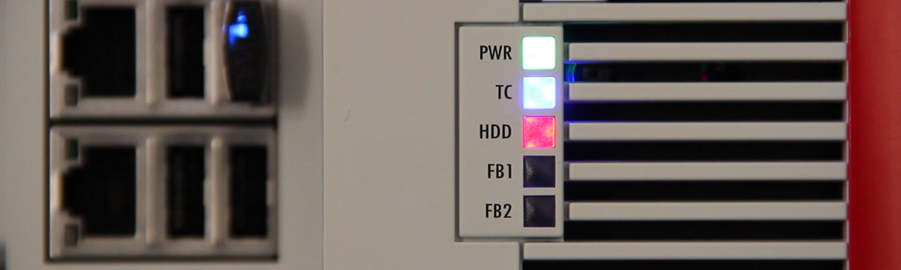

# Final words

  

There are some final words that should be mentioned in relation to this example.
What's important to note here is that we managed to develop a lot of working software just by reading specifications.
We haven't yet had any need for any hardware, but even so we can still with high confidence say things are going to work.
By making sure that we want to test only very small pieces of functionality at a time, we have designed a highly modularized pieces of software where each function block only does a small thing, but where they together implement an important part of the functionality of IO-Link.
The large amount of test code that we have produced now also acts as excellent documentation for any other developer reading your code.
If it's hard to understand what a specific function block is supposed to do, just take a look at the test code for some excellent documentation.

The final test of that the software is actually working is of course to run in on real hardware.
In [this blog post](https://sagatowski.com/posts/test_driven_development_in_twincat_part_7/) this is described, running the software on various IO-Link masters supporting the diagnosis history object.

We are at the end of this programming example, and this is a good opportunity to go through some of the gains that we achieve by writing our software using test driven development together with an unit testing framework.

**Documentation**  
Writing all this test code has resulted in some really good documentation for the software.
Simply by looking at the tests it is easy to understand what the actual software is supposed to do.
The test cases that we wrote dictate what outputs every function block should provide given a set of inputs.
With this information, any developer that looks at the test cases gets a better understanding of what the function block is supposed to do, so the test cases become examples of what the code should do.

**Fewer bugs**  
Because we can write as many test cases as we want for our code, we achieve better test coverage.
We're not only limited on what tests we can do with any hardware, but can throw any test scenario at our code.
We can test all those extreme edge cases having higher code coverage.
Because we have better code coverage, we will have fewer bugs.

**Regression test-suite**  
We can at any point run our tests and see that all tests still succeed.
At some point or another we will need to do changes in the software, for instance if we want add new functionality.
Doing changes in software can make anyone nervous, but because we have our tests we can with significantly higher confidence do any changes.
Simply run the tests again and see that nothing has broken.

**Acceptance criteria**  
When developing a certain set of functionalities, it's necessary to define what that functionality is supposed to provide.
With unit test cases, this is exactly what is done and thus these test cases become the acceptance criteria of the software.

**Clear defined interfaces**  
When defining the tests, you'll automatically define what the function blocks under test should provide, and thus you'll end up with clear defined interfaces for the function blocks.
The unit tests won't just be software for validating the application, but will also be an engine for the design of the software.

**Modularized code**  
Once you've written tests for a time, it gets natural to test small sets of functionalities at a time, and thus your function blocks usually end up quite small.
Adhering to test driven development thus leads to more modularized, extensible, and flexible code.
