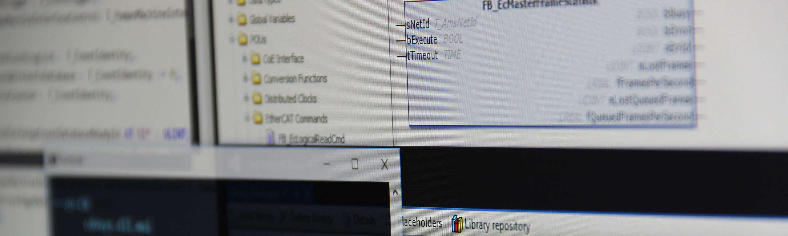

# Implementation - Part two

<p align="center">
  
</p>

The remaining function blocks to implement are:

- `FB_DiagnosticMessageTextIdentityParser`
- `FB_DiagnosticMessageTimeStampParser`
- `FB_DiagnosticMessageParser`

## FB_DiagnosticMessageTextIdentityParser

This one is easy.
We get two bytes in, and we convert those to an 16-bit unsigned integer.


A reminder of what the function block header looks like:

```declaration
FUNCTION_BLOCK FB_DiagnosticMessageTextIdentityParser
VAR_INPUT
    anTextIdentityBuffer : ARRAY[1..2] OF BYTE;
END_VAR
VAR_OUTPUT
    nTextIdentity : UINT;
END_VAR
```

What we can do is to first convert the two bytes into a `WORD` using the function `WORD_FROM_BYTES()`.
This function takes two bytes in, and delivers a `WORD` as a result.
The next step is to convert the `WORD` to an `UINT` by simple 61131-3 type-conversion. For the body, only one line of code is necessary.

```body
nTextIdentity := WORD_TO_UINT(F_WORDFromBytes(B1 := anTextIdentityBuffer[2], B0 := anTextIdentityBuffer[1]));
```

Running our three unit tests that we defined earlier we get the result:


Two additional tests that succeed.

### FB_DiagnosticMessageTimeStampParser

The timestamp parser takes an EtherCAT distributed clock (DC) timestamp (8 bytes), information of whether the timestamp is a local or global timestamp and delivers a human-readable string as output.


A reminder of what the function block header looks like:

```declaration
FUNCTION_BLOCK FB_DiagnosticMessageTimeStampParser
VAR_INPUT
    anTimeStampBuffer : ARRAY[1..8] OF BYTE;
    bIsLocalTime : BOOL;
END_VAR
VAR_OUTPUT
    sTimeStamp : STRING(29);
END_VAR
VAR
    nDCTime64 : LWORD;
    nDCTime64HighPart : DWORD;
    nDCTime64LowPart : DWORD;
END_VAR
```

As we decided in part 2, if the diagnosis event timestamp is based on a local clock, we'll just use the current task DC-time (available by using the Beckhoff function [`F_GetCurDcTaskTime64()`](https://infosys.beckhoff.com/english.php?content=../content/1033/tcplclib_tc2_ethercat/2268414091.html&id=) located inside the `Tc2_EtherCAT` library).
If the diagnosis event timestamp is global, we'll use the timestamp that is stored in these 8 bytes.
We need to have a local variable where we can store our intermediate result.
We'll call this variable `nDCTime64` and the type will be `LWORD`.
Once we have the timestamp stored in this variable we can convert it into a 29-character string again using a standard Beckhoff function, [`DCTIME64_TO_STRING()`](https://infosys.beckhoff.com/english.php?content=../content/1033/tcplclib_tc2_ethercat/2267406347.html&id=).
The end result:

```body
nDCTime64HighPart := F_DWORDFromBytes(B3 := anTimeStampBuffer[8], B2 := anTimeStampBuffer[7],
                                      B1 := anTimeStampBuffer[6], B0 := anTimeStampBuffer[5]);
nDCTime64LowPart := F_DWORDFromBytes(B3 := anTimeStampBuffer[4], B2 := anTimeStampBuffer[3],
                                     B1 := anTimeStampBuffer[2], B0 := anTimeStampBuffer[1]);
nDCTime64 := SHL(DWORD_TO_LWORD(nDCTime64HighPart), 32) OR nDCTime64LowPart;
 
IF nDCTime64 = 0 THEN
    nDCTime64 := F_GetCurDcTaskTime64();
END_IF
 
sTimeStamp := DCTIME64_TO_STRING(in := nDCTime64);
```

The `F_DWORDFromBytes()` function converts four bytes into a `DWORD`.
Running our two unit tests that we defined we get the result:


Two additional tests now succeed. Now we only have one function block left to implement!

## FB_DiagnosticMessageParser

This function block uses the other four function blocks to deliver the final result, so running the tests for this one wraps it up.
A reminder from an earlier chapter of what the function block header looks like:

```declaration
FUNCTION_BLOCK FB_DiagnosticMessageParser
VAR_INPUT
    anDiagnosticMessageBuffer : ARRAY[1..28] OF BYTE;
END_VAR
VAR_OUTPUT
    stDiagnosticMessage : ST_DIAGNOSTICMESSAGE;
END_VAR
```


This FB needs to instantiate an instance of each and one of the four function blocks that we've created.
Looking at an overview picture:


The function block `FB_DiagnosticMessageParser` (dark green in the middle) needs to take the 28 bytes in the correct order and send them to every other function block to get the final result, which is a structure of the type `ST_DIAGNOSTICMESSAGE`.
Again, for this example we only care about the first 4+2+2+8=16 bytes and ignore the last 12 bytes (which are all optional).

We'll add some more variables to the header above now that we know what we want.

```example
VAR
    anDiagnosticCodeBuffer : ARRAY[1..4] OF BYTE;
    anFlagsBuffer : ARRAY[1..2] OF BYTE;
    anTextIdentityBuffer : ARRAY[1..2] OF BYTE;
    anTimeStampBuffer : ARRAY[1..8] OF BYTE;
    anIOLinkParametersBuffer : ARRAY[1..12] OF BYTE;
 
    fbDiagnosticMessageDiagnosticCodeParser : FB_DiagnosticMessageDiagnosticCodeParser;
    fbDiagnosticMessageFlagsParser : FB_DiagnosticMessageFlagsParser;
    fbDiagnosticMessageTextIdentityParser : FB_DiagnosticMessageTextIdentityParser;
    fbDiagnosticMessageTimeStampParser : FB_DiagnosticMessageTimeStampParser;
END_VAR
```

The four arrays of BYTEs are used as input to the call for all four function blocks.
For the function block body we can do:

```body
// Parse diagnostic code
anDiagnosticCodeBuffer[1] := anDiagnosticMessageBuffer[1];
anDiagnosticCodeBuffer[2] := anDiagnosticMessageBuffer[2];
anDiagnosticCodeBuffer[3] := anDiagnosticMessageBuffer[3];
anDiagnosticCodeBuffer[4] := anDiagnosticMessageBuffer[4];
fbDiagnosticMessageDiagnosticCodeParser(anDiagnosticCodeBuffer := anDiagnosticCodeBuffer,
                                        stDiagnosticCode => stDiagnosticMessage.stDiagnosticCode);
 
// Parse flags
anFlagsBuffer[1] := anDiagnosticMessageBuffer[5];
anFlagsBuffer[2] := anDiagnosticMessageBuffer[6];
fbDiagnosticMessageFlagsParser(anFlagsBuffer := anFlagsBuffer,
                               stFlags => stDiagnosticMessage.stFlags);
 
// Parse text identity
anTextIdentityBuffer[1] := anDiagnosticMessageBuffer[7];
anTextIdentityBuffer[2] := anDiagnosticMessageBuffer[8];
fbDiagnosticMessageTextIdentityParser(anTextIdentityBuffer := anTextIdentityBuffer,
                                      nTextIdentity => stDiagnosticMessage.nTextIdentityReferenceToESIFile);
 
// Parse time stamp
anTimeStampBuffer[1] := anDiagnosticMessageBuffer[9];
anTimeStampBuffer[2] := anDiagnosticMessageBuffer[10];
anTimeStampBuffer[3] := anDiagnosticMessageBuffer[11];
anTimeStampBuffer[4] := anDiagnosticMessageBuffer[12];
anTimeStampBuffer[5] := anDiagnosticMessageBuffer[13];
anTimeStampBuffer[6] := anDiagnosticMessageBuffer[14];
anTimeStampBuffer[7] := anDiagnosticMessageBuffer[15];
anTimeStampBuffer[8] := anDiagnosticMessageBuffer[16];
fbDiagnosticMessageTimeStampParser(anTimeStampBuffer := anTimeStampBuffer,
                                   bIsLocalTime := (stDiagnosticMessage.stFlags.eTimeStampType = E_TIMESTAMPTYPE.Local),
                                   sTimeStamp => stDiagnosticMessage.sTimeStamp);
```

Here we are preparing the input for every function block by copying the correct bytes from the total 28 bytes.
Then we are calling each and one of the four function blocks and store the result in the total output variable (`stDiagnosticMessage`).
Each test prepares various combinations of a diagnosis event message, so that we can test as a big diversity as possible.
Running our test-program `PRG_TEST` and looking at the result of the unit tests for this function block we get:


Success!
Again it's important for to point out that at first, these tests failed.
Normally one has to continuously rewrite the code and re-run the tests until all the tests pass.
This is completely normal, and the whole reason you've written the unit tests to start with.
As you have all your unit tests, just run them and you will immediately know whether your code is doing what it's supposed to.