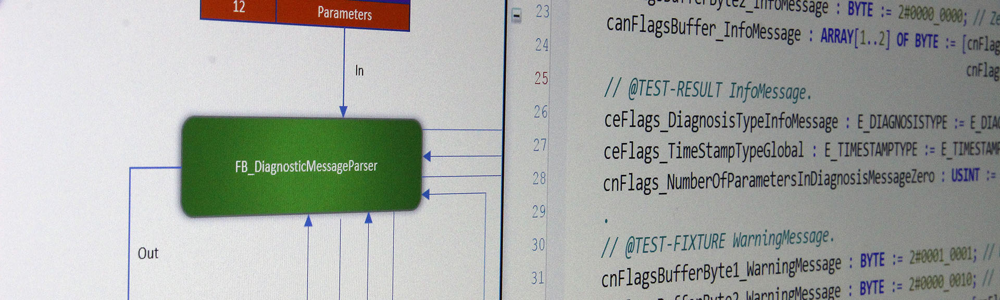

# Test cases - Part one

<p align="center">
  
</p>

As our IO-Link project is a library project and thus won't have any runnable tasks to be running in any PLC, we still need to have a task and a program to run our unit tests.
This task will be running on our local development machine.
We need to create a task/program inside the library project which initiates all the unit tests, so we can run the unit tests which in turn initializes the library code that we want to test.
One suggestion is to put all unit tests in a folder called test next to the standard folder `POUs`, which are initialized by the program `PRG_TEST`. For every function block we've defined, we'll create an accompanying test function block (test suite).
One standard is to call this test suite the same as the function block that we want to test, but add "_test" in the name.
The framework does not enforce any naming rules, this is entirely up to the user to decide on a naming convention.


As can be seen here every FB that we've defined a functionality for has an accompanying test-FB (test suite).
By structuring all your libraries in this way, all the function blocks and unit tests will always be available together.
Also, by having the program/task available in the library project, any developer can at anytime run the unit tests.
This is an excellent way to package everything nicely together.

Next, we instantiate every test suite in `PRG_MAIN`, and every test suite in turn instantiates the FB that it is supposed to test.
Every test suite can do as many tests for the FB under test as you want, i.e. make calls to the FBs with different inputs to test various scenarios.
One example for a parser FB could be to test min/mid/max values as input, totaling to three different tests.


This figure shows:

1. We create a total of five test suites, one for every real function block
2. We instantiate the test suites in `PRG_MAIN`
3. We create several test cases for every function block. Each test case tests the function block for certain inputs (test fixture) and expects certain outputs (test result)
4. `PRG_MAIN` calls each test suite

Every test that we are going to run requires some sort of test fixture, which are the prerequisites for the test.
In our case, this will be setting up the data bytes used as input for the function block under test.
For every test that we will run we will have to do an assertion, checking whether the result (output) we get from our function block is equal to the expected result.

Let's start by creating the five test suites (orange above), and instantiating them in `PRG_TEST` and running them.

```example
PROGRAM PRG_TEST
VAR
    fbDiagnosticMessageDiagnosticCodeParser_Test : FB_DiagnosticMessageDiagnosticCodeParser_Test;
    fbDiagnosticMessageFlagsParser_Test : FB_DiagnosticMessageFlagsParser_Test;
    fbDiagnosticMessageParser_Test : FB_DiagnosticMessageParser_Test;
    fbDiagnosticMessageTextIdentityParser_Test : FB_DiagnosticMessageTextIdentityParser_Test;
    fbDiagnosticMessageTimeStampParser_Test : FB_DiagnosticMessageTimeStampParser_Test;
END_VAR
---------------------------------------
TcUnit.RUN();
```

What we need to do now is to implement each unit test-FB with some tests that we think should be included for each parser.

## FB_DiagnosticMessageDiagnosticCodeParser_Test

The function block `FB_DiagnosticMessageDiagnosticCodeParser` is responsible for parsing a diagnostic code type (ManufacturerSpecific, EmergencyErrorCode or ProfileSpecific) together with the code itself.

```declaration
FUNCTION_BLOCK FB_DiagnosticMessageDiagnosticCodeParser_Test EXTENDS TcUnit.FB_TestSuite
```

This is the required layout of the header of a test suite just as described in the [introduction user guide](introduction-user-guide.md).

Our next step is setting up all test fixtures and the expected test results.
Here we need to think about the different test cases that we would like to run.
We want to make sure our function block correctly parses the three different diagnostic code types, but we also want to make sure our code correctly handles the case when the IO-Link master for instance outputs a diagnosis code type that's not valid (Reserved for future use for instance). In this case we want to make sure our function block sets it to “Unspecified”. To make sure that our code handles all these different cases, we want four good tests.

The first test will represent an emergency code, and the header of the method defining the test will look like follows:

```body
METHOD PRIVATE WhenEmergencyErrorCodeExpectEmergencyErrorCode
VAR
    fbDiagnosticMessageDiagnosticCodeParser : FB_DiagnosticMessageDiagnosticCodeParser;
    stDiagnosticCode : ST_DIAGNOSTICCODE;
 
    // @TEST-FIXTURE EmergencyErrorCode
    cnDiagnosticCodeBufferByte1_EmergencyErrorCode : BYTE := 16#00; // 16#E800
    cnDiagnosticCodeBufferByte2_EmergencyErrorCode : BYTE := 16#E8;
    cnDiagnosticCodeBufferByte3_EmergencyErrorCode : BYTE := 16#30; // 16#7530 = 10#30000
    cnDiagnosticCodeBufferByte4_EmergencyErrorCode : BYTE := 16#75;
    canDiagnosticCodeBuffer_EmergencyErrorCode : ARRAY[1..4] OF BYTE := [
                                                cnDiagnosticCodeBufferByte1_EmergencyErrorCode,
                                                cnDiagnosticCodeBufferByte2_EmergencyErrorCode,
                                                cnDiagnosticCodeBufferByte3_EmergencyErrorCode,
                                                cnDiagnosticCodeBufferByte4_EmergencyErrorCode];
    // @TEST-RESULT EmergencyErrorCode
    ceDiagnosticCodeType_EmergencyErrorCode : E_DIAGNOSTICCODETYPE := E_DIAGNOSTICCODETYPE.EmergencyErrorCodeDS301;
    cnDiagnosticCode_EmergencyErrorCode : UINT := 10#30000;
END_VAR
```

The two variables are the declaration of the function block under test (`fbDiagnosticMessageDiagnosticCodeParser`) and the structure where the result will be stored (`stDiagnosticCode`).
The `stDiagnosticCode` variable is the output of the FB that we'll be testing, and this is thus the one that we will compare the expected result with.
The variables starting with "c" are the input variables for our test (test fixture) and the expected result.
The four bytes for our test fixture represents:

|Bit 0-15|Bit 16-31|
|-|-|
|0x0000-0xDFFF|not used|
|0xE000-0xE7FF|can be used manufacturer specific|
|0xE800|Emergency Error Code as defined in DS301 or DS4xxx|
|0xE801-0xEDFF|reserved for future standardization|
|0xEE00-0xEFFF|Profile specific|
|0xF000-0xFFFF|not used|

We have two bytes for the type of diagnosis code, and two bytes for the code itself.
Emergency error code is defined as `0xE800`, and we set the code itself to `0x7530` (representing a decimal value of 30000).


We put these four bytes into an array, which we'll be using as an input to the FB under test once we are going to run our tests.
The test result for the struct that the function block outputs should be `EmergencyErrorCodeDS301` and 30000 (decimal), which is the result defined under the `@TEST-RESULT`.

Next we move to the body of the test suite:

```body
TEST('WhenEmergencyErrorCodeExpectEmergencyErrorCode');
 
// @TEST-RUN
fbDiagnosticMessageDiagnosticCodeParser(anDiagnosticCodeBuffer := canDiagnosticCodeBuffer_EmergencyErrorCode,
                                        stDiagnosticCode => stDiagnosticCode);
 
// @TEST-ASSERT
AssertEquals(Expected := ceDiagnosticCodeType_EmergencyErrorCode,
             Actual := stDiagnosticCode.eDiagnosticCodeType,
             Message := 'Test $'emergency error code$' failed at $'diagnostic code type$'');
AssertEquals(Expected := cnDiagnosticCode_EmergencyErrorCode,
             Actual := stDiagnosticCode.nCode,
             Message := 'Test $'emergency error code$' failed at $'diagnostic code$'');
 
TEST_FINISHED();
```

What we're doing here is to run the test by calling the function block with our test fixture (defined as an array) as input, and checking (by asserting) whether the result we get in our output is according to our expected test-result.
And that's basically everything there is to it!
If we were to run our code now, the test would fail simply because our function block doesn't do anything as it has not yet been implemented!
Note that we need to finish the method with a call to `TEST_FINISHED()` to indicate to the testing framework that this is the end of the tests.
This gives the possibility to have tests that span over multiple PLC-cycles, as it's possible to have a condition that needs to be reached before calling `TEST_FINISHED()`.
Before doing any implementation code, we need to finish our different test cases so we cover as much scenarios as possible.
What follows are three additional test fixtures and expected test results.

**Test `WhenManufacturerSpecificExpectManufacturerSpecific`**

```body
METHOD PRIVATE WhenManufacturerSpecificExpectManufacturerSpecific
VAR
    fbDiagnosticMessageDiagnosticCodeParser : FB_DiagnosticMessageDiagnosticCodeParser;
    stDiagnosticCode : ST_DIAGNOSTICCODE;
 
    // @TEST-FIXTURE ManuFacturerSpecific
    cnDiagnosticCodeBufferByte1_ManufacturerSpecific : BYTE := 16#00; // 16#E000 (in range of 0xE000 - 0xE7FF)
    cnDiagnosticCodeBufferByte2_ManufacturerSpecific : BYTE := 16#E0;
    cnDiagnosticCodeBufferByte3_ManufacturerSpecific : BYTE := 16#E8; // 16#03E8 = 10#1000
    cnDiagnosticCodeBufferByte4_ManufacturerSpecific : BYTE := 16#03;
    canDiagnosticCodeBuffer_ManufacturerSpecific : ARRAY[1..4] OF BYTE := [
                                                cnDiagnosticCodeBufferByte1_ManufacturerSpecific,
                                                cnDiagnosticCodeBufferByte2_ManufacturerSpecific,
                                                cnDiagnosticCodeBufferByte3_ManufacturerSpecific,
                                                cnDiagnosticCodeBufferByte4_ManufacturerSpecific];
                                                 
    // @TEST-RESULT ManuFacturerSpecific
    ceDiagnosticCodeType_ManufacturerSpecific : E_DIAGNOSTICCODETYPE := E_DIAGNOSTICCODETYPE.ManufacturerSpecific;
    cnDiagnosticCode_ManufacturerSpecific : UINT := 10#1000;
END_VAR
-----------------------------------------------------------
TEST('WhenManufacturerSpecificExpectManufacturerSpecific');
 
// @TEST-RUN
fbDiagnosticMessageDiagnosticCodeParser(anDiagnosticCodeBuffer := canDiagnosticCodeBuffer_ManufacturerSpecific,
                                        stDiagnosticCode => stDiagnosticCode);
 
// @TEST-ASSERT
AssertEquals(Expected := ceDiagnosticCodeType_ManufacturerSpecific,
             Actual := stDiagnosticCode.eDiagnosticCodeType,
             Message := 'Test $'manufacturer specific$' failed at $'diagnostic code type$'');
AssertEquals(Expected := cnDiagnosticCode_ManufacturerSpecific,
             Actual := stDiagnosticCode.nCode,
             Message := 'Test $'manufacturer specific$' failed at $'diagnostic code$'');
 
TEST_FINISHED();

```

**Test `WhenProfileSpecificExpectProfileSpecific`**

```body
METHOD PRIVATE WhenProfileSpecificExpectProfileSpecific
VAR
    fbDiagnosticMessageDiagnosticCodeParser : FB_DiagnosticMessageDiagnosticCodeParser;
    stDiagnosticCode : ST_DIAGNOSTICCODE;
 
    // @TEST-FIXTURE ProfileSpecific
    cnDiagnosticCodeBufferByte1_ProfileSpecific : BYTE := 16#10; // 16#EF10 (in range of 0xEE00 - 0xEFFF)
    cnDiagnosticCodeBufferByte2_ProfileSpecific : BYTE := 16#EF;
    cnDiagnosticCodeBufferByte3_ProfileSpecific : BYTE := 16#FF; // 16#FFFF = 10#65535
    cnDiagnosticCodeBufferByte4_ProfileSpecific : BYTE := 16#FF;
    canDiagnosticCodeBuffer_ProfileSpecific : ARRAY[1..4] OF BYTE := [
                                                cnDiagnosticCodeBufferByte1_ProfileSpecific,
                                                cnDiagnosticCodeBufferByte2_ProfileSpecific,
                                                cnDiagnosticCodeBufferByte3_ProfileSpecific,
                                                cnDiagnosticCodeBufferByte4_ProfileSpecific];
 
    // @TEST-RESULT ProfileSpecific
    ceDiagnosticCodeType_ProfileSpecific : E_DIAGNOSTICCODETYPE := E_DIAGNOSTICCODETYPE.ProfileSpecific;
    cnDiagnosticCode_ProfileSpecific : UINT := 10#65535;
END_VAR
-------------------------------------------------
TEST('WhenProfileSpecificExpectProfileSpecific');
 
// @TEST-RUN
fbDiagnosticMessageDiagnosticCodeParser(anDiagnosticCodeBuffer := canDiagnosticCodeBuffer_ProfileSpecific,
                                        stDiagnosticCode => stDiagnosticCode);
 
// @TEST-ASSERT
AssertEquals(Expected := ceDiagnosticCodeType_ProfileSpecific,
             Actual := stDiagnosticCode.eDiagnosticCodeType,
             Message := 'Test $'profile specific$' failed at $'diagnostic code type$'');
AssertEquals(Expected := cnDiagnosticCode_ProfileSpecific,
             Actual := stDiagnosticCode.nCode,
             Message := 'Test $'profile specific$' failed at $'diagnostic code$'');
 
TEST_FINISHED();
```

**Test `WhenReservedForFutureUseExpectReservedForFutureUse`**

```body
METHOD PRIVATE WhenReservedForFutureUseExpectReservedForFutureUse
VAR
    fbDiagnosticMessageDiagnosticCodeParser : FB_DiagnosticMessageDiagnosticCodeParser;
    stDiagnosticCode : ST_DIAGNOSTICCODE;
 
    // @TEST-FIXTURE ReservedForFutureUse
    cnDiagnosticCodeBufferByte1_ReservedForFutureUse : BYTE := 16#01; // 16#E801 (in range of 0xE801 - 0xEDFF)
    cnDiagnosticCodeBufferByte2_ReservedForFutureUse : BYTE := 16#E8;
    cnDiagnosticCodeBufferByte3_ReservedForFutureUse : BYTE := 16#D9; // 16#3BD9 = 10#15321
    cnDiagnosticCodeBufferByte4_ReservedForFutureUse : BYTE := 16#3B;
    canDiagnosticCodeBuffer_ReservedForFutureUse : ARRAY[1..4] OF BYTE := [
                                                cnDiagnosticCodeBufferByte1_ReservedForFutureUse,
                                                cnDiagnosticCodeBufferByte2_ReservedForFutureUse,
                                                cnDiagnosticCodeBufferByte3_ReservedForFutureUse,
                                                cnDiagnosticCodeBufferByte4_ReservedForFutureUse];
 
    // @TEST-RESULT ReservedForFutureUse
    ceDiagnosticCodeType_ReservedForFutureUse : E_DIAGNOSTICCODETYPE := E_DIAGNOSTICCODETYPE.Unspecified;
    cnDiagnosticCode_ReservedForFutureUse : UINT := 10#15321;
END_VAR
 
TEST('WhenReservedForFutureUseExpectReservedForFutureUse');
 
// @TEST-RUN
fbDiagnosticMessageDiagnosticCodeParser(anDiagnosticCodeBuffer := canDiagnosticCodeBuffer_ReservedForFutureUse,
                                        stDiagnosticCode => stDiagnosticCode);
 
// @TEST-ASSERT
AssertEquals(Expected := ceDiagnosticCodeType_ReservedForFutureUse,
             Actual := stDiagnosticCode.eDiagnosticCodeType,
             Message := 'Test $'reserved for future use$' failed at $'diagnostic code type$'');
AssertEquals(Expected := cnDiagnosticCode_ReservedForFutureUse,
             Actual := stDiagnosticCode.nCode,
             Message := 'Test $'reserved for future use$' failed at $'diagnostic code$'');
 
TEST_FINISHED();
```

We basically cover all the different use cases for the type of diagnosis code.
Notice that the test fixture is a code that according to the ETG1020 specification is "reserved for future use", while our result should be "unspecified".
We should handle all reserved/unknown as "Unspecified", and thus this is what the output of our function block should be.
Every time we run the function block under test, we assert that the output (`stDiagnosticCode`) is equal to our expected `@TEST-RESULT`.

Next we need to make sure to call all the tests in the body of the test suite.

```body
WhenEmergencyErrorCodeExpectEmergencyErrorCode();
WhenManufacturerSpecificExpectManufacturerSpecific();
WhenProfileSpecificExpectProfileSpecific();
WhenReservedForFutureUseExpectReservedForFutureUse();
```
