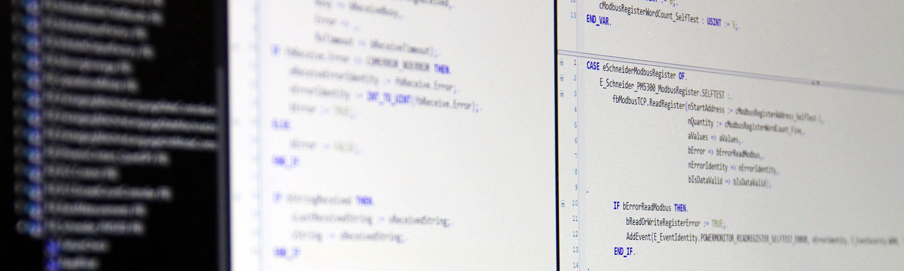

# The function blocks

<p align="center">
  
</p>

Let's create the headers for all the function blocks that we will write unit tests for.
What we'll do is to create a function block for parsing each and one of the parameters (a total number of four), and an additional function block that uses all these four separate function blocks to deliver the result in the struct `ST_DIAGNOSTICMESSAGE`.
A rudimentary scheme for this looks like follows:


Note that we at this stage are not implementing the function blocks, we're only stating what functionality they must provide, by declaring their interfaces.
As this example is quite simple, we'll solve that for every function block by making them provide a function block output.
The function blocks and their headers will have the following layout:

## Main diagnosis message event parser

```declaration
FUNCTION_BLOCK FB_DiagnosticMessageParser
VAR_INPUT
    anDiagnosticMessageBuffer : ARRAY[1..28] OF BYTE;
END_VAR
VAR_OUTPUT
    stDiagnosticMessage : ST_DIAGNOSTICMESSAGE;
END_VAR
```

This takes the 28 bytes that we receive from the IO-Link master, and outputs the complete diagnostic message according to the layout of our struct `ST_DIAGNOSTICMESSAGE` described earlier.
Note that in this example we'll only make use of the first 16 (mandatory) bytes, and ignore the 12 (optional) bytes.

## Diagnostic code parser

```declaration
FUNCTION_BLOCK FB_DiagnosticMessageDiagnosticCodeParser
VAR_INPUT
    anDiagnosticCodeBuffer : ARRAY[1..4] OF BYTE;
END_VAR
VAR_OUTPUT
    stDiagnosticCode : ST_DIAGNOSTICCODE;
END_VAR
```

This function block takes four of the 28 bytes as input and outputs the diagnostic code according to the layout of our struct `ST_DIAGNOSTICCODE` described earlier.

## Flags parser

```declaration
FUNCTION_BLOCK FB_DiagnosticMessageFlagsParser
VAR_INPUT
    anFlagsBuffer : ARRAY[1..2] OF BYTE;
END_VAR
VAR_OUTPUT
    stFlags : ST_FLAGS;
END_VAR
```

This function block takes two of the 28 bytes as input and outputs the flags according to the layout of our struct `ST_FLAGS` described earlier.

## Text identity parser

```declaration
FUNCTION_BLOCK FB_DiagnosticMessageTextIdentityParser
VAR_INPUT
    anTextIdentityBuffer : ARRAY[1..2] OF BYTE;
END_VAR
VAR_OUTPUT
    nTextIdentity : UINT;
END_VAR
```

This function block takes two of the 28 bytes as input and outputs the text identity as an unsigned integer according to the description earlier.

## Timestamp parser

```declaration
FUNCTION_BLOCK FB_DiagnosticMessageTimeStampParser
VAR_INPUT
    anTimeStampBuffer : ARRAY[1..8] OF BYTE;
    bIsLocalTime : BOOL;
END_VAR
VAR_OUTPUT
    sTimeStamp : STRING(29);
END_VAR
```

This function block takes eight of the 28 bytes as input and outputs the timestamp as a human-readable string.
Note that we also have a bIsLocalTime input, as we want to have different handling on the parsing of the timestamp depending on whether the timestamp is a local or global time stamp.
This could be handled in many ways, but for the sake of this example we'll handle the timestamp as:

- If it's global, the timestamp is based on the EtherCAT distributed clock of the system and we'll make use of/parse the eight bytes
- If it's local, we ignore the eight bytes and instead return the current task distributed clock time

Although this text is about unit testing, it's worth pointing out that we could handle this differently in such a way that if the timestamp is local, we could read-out the local time of the EtherCAT slave/IO-Link master (if available, located in CoE object 0x10F8), and then calculate what the global time stamp is by calculating the age of the message, and subtracting this from the current DC-time.

And that's it!
Now we have prepared all the data types and function blocks that together form the functionality specification of our parser.
What's nice about this is that we now have formed the acceptance criteria for the expected functionality, which are all the outputs of the function blocks.
If we run our function blocks now with real input, they will of course not return the correct values.
Everything returned will just be with the default values of the different structures.
Our next step will be to write the unit tests that will make our tests fail, and once that is done (and not before!), we'll write the actual body (implementation) code for the function blocks.
