## Introduction

For this example we are going to develop a TwinCAT library with some well defined functionality using test driven development with the TcUnit framework.
The scope of the library will be developing functions to handle certain aspects of the IO-Link communication.
IO-Link is a digital point-to-point (master and slave) serial communication protocol.
It's used to extend or replace the standard analog (0..10V, 4..20mA, +/- 10V etc) sensors with a digital interface.
With IO-Link you get a significantly improved and extended integration with the lowest level sensors in your system.
We won't go too much into details specifically about IO-Link, instead it's highly recommended to read more about it on the [IO-Link website](https://io-link.com/en/index.php).

For this topic however, what is important to know is that IO-Link provides certain services.
One of the functionalities of IO-Link devices is that they can fire off events to the IO-Link master to notify that something has happened, for instance an alarm that something is wrong.
By using an IO-Link master that is using EtherCAT for fieldbus communications to the higher level system (PLC) we can receive the events by doing CoE reads.
When using an EtherCAT-capable IO-Link master such as:

- [Balluff BNI0077](https://www.balluff.com/en-us/products/BNI0077#?data=)
- [Beckhoff EL6224](https://www.beckhoff.com/en-en/products/i-o/ethercat-terminals/el6xxx-communication/el6224.html#:~:text=The%20EL6224%20IO%2DLink%20terminal,the%20terminal%20and%20the%20device.) or [EP6224](https://www.beckhoff.com/en-en/products/i-o/ethercat-box/epxxxx-industrial-housing/ep6xxx-communication/ep6224-0042.html)/[EP6228](https://www.beckhoff.com/en-en/products/i-o/ethercat-box/epxxxx-industrial-housing/ep6xxx-communication/ep6228-0022.html)
- [IFM AL1332](https://www.ifm.com/de/en/product/AL1332)
- [Omron GX-ILM08C](https://www.ia.omron.com/products/family/3541/)

which all support the CoE diagnosis history object (0x10F3), all IO-Link events are stored in the memory of the device.
It's important to note that the diagnosis history object (0x10F3) can be implemented by any EtherCAT slave to store diagnostic type of data, not only IO-Link events.
Note that the implementation of the diagnosis history object is optional by the manufacturer.
Whether the diagnosis history object is implemented or not is reported by a flag in the ESI-file of the EtherCAT slave.
According to EtherCAT Technology Group document "[ETG1020 – EtherCAT Protocol Enhancements](https://www.ethercat.org/en/downloads/downloads_00600A7B120E41D385DC0AF19C034434.htm)", each message logged in the diagnostic history object has the following data:

- Diagnosis code (4 bytes) – mandatory
- Flags (2 bytes) – mandatory
- Text ID (2 bytes) – mandatory
- Timestamp (8 bytes) – mandatory
- Optional parameters – optional

This is only a description of the data on a high level, for all the details on what's exactly included on a bit-level all information can be found in ETG1020.
The number of optional parameters can be varying (zero parameters as well) depending on the diagnosis message itself.

## Data to be parsed

What we will do here is to create test cases to parse each and one of the mandatory fields.
Each field will be parsed by its own function block that will provide the data above in a structured manner.
Looking at the diagnosis history object, the diagnosis messages themselves are an array of bytes that are read by SDO read. For this particular example, we assume we have the stream of bytes already prepared by the SDO read.
We will not focus on creating test cases for the SDO read, but rather focus on the parsing.
In one of the tested IO-Link masters, the diagnosis history message object is up to 28 bytes, which means that the IO-Link master on top of the above data also supports a certain number of parameters.
As said above however, we'll focus on the parsing of the first 4+2+2+8 = 16 bytes, as the first four parameters in the diagnosis message are mandatory whilst the parameters are optional.
What we need to do now is to create a data structure for each of the data fields above.

Before we start to dwell too deep into the code, it's good to know that all the source code for the complete example is available [on GitHub](https://github.com/tcunit/ExampleProjects/tree/master/AdvancedExampleProject), as it might be preferred to look at the code in the Visual Studio IDE rather than on a webpage.

### Diagnosis code

The diagnosis code looks like this:

| Bit 0-15 | Bit 16-31 |
|-|-|
|0x0000-0xDFFF|Not used|
|0xE000-0xE7FF|Can be used manufacturer specific|
|0xE800|Emergency Error Code as defined in DS301 or DS4xxx|
|0xE801-0xEDFF|Reserved for future standardization|
|0xEE00-0xEFFF|Profile specific|
|0xF000-0xFFFF|Not used|

We'll create a struct for it:

```StructuredText
TYPE ST_DIAGNOSTICCODE :
STRUCT
    eDiagnosticCodeType : E_DIAGNOSTICCODETYPE;
    nCode : UINT;
END_STRUCT
END_TYPE
```

where the `E_DIAGNOSTICCODETYPE` is

```StructuredText
TYPE E_DIAGNOSTICCODETYPE :
(
    ManufacturerSpecific := 0,
    EmergencyErrorCodeDS301 := 1,
    ProfileSpecific := 2,
    Unspecified := 3
) USINT;
END_TYPE
```

What we're basically doing here is to first look at the first 16 bits, and categorizing them into any of the four possibilities of the enumeration `E_DIAGNOSTICCODETYPE`.
All unknowns (reserved, not used) are set as `E_DIAGNOSTICCODETYPE.Unspecified`.
Then we convert bit 16-31 into nCode. These two together will create the struct `ST_DIAGNOSTICCODE`.

### Flags

The flags have three parameters: "Diagnosis type", "Time stamp type", "Number of parameters in the diagnosis message".
|Bit|Description|
|-|-|
|Bit 0-3|0: Info message, 1: Warning message, 2: Error message, 3-15: Reserved for future use|
|Bit 4|Time stamp is a local time stamp|
|Bit 5-7|Reserved for future use|
|Bit 8-15|Number of parameters in this diagnosis message|

We'll create a struct for it:

```StructuredText
TYPE ST_FLAGS :
STRUCT
    eDiagnostisType : E_DIAGNOSISTYPE;
    eTimeStampType : E_TIMESTAMPTYPE;
    nNumberOfParametersInDiagnosisMessage : USINT;
END_STRUCT
END_TYPE
```

Where `E_DiagnosisType` and `E_TimeStampType` are respectively:

```StructuredText
TYPE E_DIAGNOSISTYPE :
(
    InfoMessage := 0,
    WarningMessage := 1,
    ErrorMessage := 2,
    Unspecified := 3
) BYTE;
END_TYPE
```

Where the `Unspecified` value is there in case we would receive one of the values that are reserved for future standardization.

```StructuredText
TYPE E_TIMESTAMPTYPE :
(
    Local := 0,
    Global := 1
) USINT;
END_TYPE
```

The timestamp is obtained from the local clock of the terminal at the time of the event.
The difference between the global and local timestamp is that the global is based on the DC-clock of the reference clock (and is thus global on the whole DC network), whilst a local clock is only used internally in the EtherCAT slave.
It's interesting to store this information as you probably want to handle the reading of the timestamp differently depending on if it's a local or a global timestamp.

### Text identity

The text identity is just a simple unsigned integer (0-65535) value which is a reference to the diagnosis text file located in the ESI-xml file for the IO-Link master.
This information is valuable if you want to do further analysis on the event, as it will give you more details on the event in a textual format.

### Time stamp

The 64 bit timestamp is either the EtherCAT DC-clock timestamp or the local time stamp of the EtherCAT slave/IO-Link master, depending on whether DC is enabled and/or the IO-Link master supports DC.
The 64-bit value holds data with 1ns resolution.

### The complete diagnostic message

Now that we have all four diagnosis message parameters, we'll finish off by creating a structure for them that our parser will deliver as output once a new diagnosis event has occurred.
Based on the information provided above it will have the following layout:

```StructuredText
TYPE ST_DIAGNOSTICMESSAGE :
STRUCT
    stDiagnosticCode : ST_DIAGNOSTICCODE;
    stFlags : ST_FLAGS;
    nTextIdentityReferenceToESIFile : UINT;
    sTimeStamp : STRING(29);
END_STRUCT
END_TYPE
```

Here you can obviously have the timestamp as a `DC_Time64`-type instead of the `STRING`-type, as it's normally more interesting to store time/data as strings the closer you come to the operator.
But for the sake of showing the concept of writing unit test cases, we'll stick to strings.
The reason we went for a 29 byte is because this is the size of the string that is returned when doing a `DCTIME64_TO_STRING()` function call.

## The function blocks

Let's create the headers for all the function blocks that we will write unit tests for.
What we'll do is to create a function block for parsing each and one of the parameters (a total number of four), and an additional function block that uses all these four separate function blocks to deliver the result in the struct `ST_DIAGNOSTICMESSAGE`.
A rudimentary scheme for this looks like follows:


Note that we at this stage are not implementing the function blocks, we're only stating what functionality they must provide, by declaring their interfaces.
As this example is quite simple, we'll solve that for every function block by making them provide a function block output.
The function blocks and their headers will have the following layout:

### Main diagnosis message event parser

```StructuredText
FUNCTION_BLOCK FB_DiagnosticMessageParser
VAR_INPUT
    anDiagnosticMessageBuffer : ARRAY[1..28] OF BYTE;
END_VAR
VAR_OUTPUT
    stDiagnosticMessage : ST_DIAGNOSTICMESSAGE;
END_VAR
```

This takes the 28 bytes that we receive from the IO-Link master, and outputs the complete diagnostic message according to the layout of our struct `ST_DIAGNOSTICMESSAGE` described earlier.
Note that in this example we'll only make use of the first 16 (mandatory) bytes, and ignore the 12 (optional) bytes.

### Diagnostic code parser

```StructuredText
FUNCTION_BLOCK FB_DiagnosticMessageDiagnosticCodeParser
VAR_INPUT
    anDiagnosticCodeBuffer : ARRAY[1..4] OF BYTE;
END_VAR
VAR_OUTPUT
    stDiagnosticCode : ST_DIAGNOSTICCODE;
END_VAR
```

This function block takes four of the 28 bytes as input and outputs the diagnostic code according to the layout of our struct `ST_DIAGNOSTICCODE` described earlier.

### Flags parser

```StructuredText
FUNCTION_BLOCK FB_DiagnosticMessageFlagsParser
VAR_INPUT
    anFlagsBuffer : ARRAY[1..2] OF BYTE;
END_VAR
VAR_OUTPUT
    stFlags : ST_FLAGS;
END_VAR
```

This function block takes two of the 28 bytes as input and outputs the flags according to the layout of our struct `ST_FLAGS` described earlier.

### Text identity parser

```StructuredText
FUNCTION_BLOCK FB_DiagnosticMessageTextIdentityParser
VAR_INPUT
    anTextIdentityBuffer : ARRAY[1..2] OF BYTE;
END_VAR
VAR_OUTPUT
    nTextIdentity : UINT;
END_VAR
```

This function block takes two of the 28 bytes as input and outputs the text identity as an unsigned integer according to the description earlier.

### Timestamp parser

```StructuredText
FUNCTION_BLOCK FB_DiagnosticMessageTimeStampParser
VAR_INPUT
    anTimeStampBuffer : ARRAY[1..8] OF BYTE;
    bIsLocalTime : BOOL;
END_VAR
VAR_OUTPUT
    sTimeStamp : STRING(29);
END_VAR
```

This function block takes eight of the 28 bytes as input and outputs the timestamp as a human-readable string.
Note that we also have a bIsLocalTime input, as we want to have different handling on the parsing of the timestamp depending on whether the timestamp is a local or global time stamp.
This could be handled in many ways, but for the sake of this example we'll handle the timestamp as:

- If it's global, the timestamp is based on the EtherCAT distributed clock of the system and we'll make use of/parse the eight bytes
- If it's local, we ignore the eight bytes and instead return the current task distributed clock time

Although this text is about unit testing, it's worth pointing out that we could handle this differently in such a way that if the timestamp is local, we could read-out the local time of the EtherCAT slave/IO-Link master (if available, located in CoE object 0x10F8), and then calculate what the global time stamp is by calculating the age of the message, and subtracting this from the current DC-time.

And that's it!
Now we have prepared all the data types and function blocks that together form the functionality specification of our parser.
What's nice about this is that we now have formed the acceptance criteria for the expected functionality, which are all the outputs of the function blocks.
If we run our function blocks now with real input, they will of course not return the correct values.
Everything returned will just be with the default values of the different structures.
Our next step will be to write the unit tests that will make our tests fail, and once that is done (and not before!), we'll write the actual body (implementation) code for the function blocks.

## Test cases

As our IO-Link project is a library project and thus won't have any runnable tasks to be running in any PLC, we still need to have a task and a program to run our unit tests.
This task will be running on our local development machine.
We need to create a task/program inside the library project which initiates all the unit tests, so we can run the unit tests which in turn initializes the library code that we want to test.
One suggestion is to put all unit tests in a folder called test next to the standard folder `POUs`, which are initialized by the program `PRG_TEST`. For every function block we've defined, we'll create an accompanying test function block (test suite).
One standard is to call this test suite the same as the function block that we want to test, but add "_test" in the name.
The framework does not enforce any naming rules, this is entirely up to the user to decide on a naming convention.

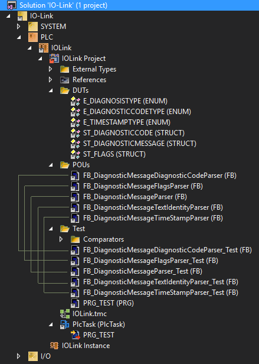

As can be seen here every FB that we've defined a functionality for has an accompanying test-FB (test suite).
By structuring all your libraries in this way, all the function blocks and unit tests will always be available together.
Also, by having the program/task available in the library project, any developer can at anytime run the unit tests.
This is an excellent way to package everything nicely together.

Next, we instantiate every test suite in `PRG_MAIN`, and every test suite in turn instantiates the FB that it is supposed to test.
Every test suite can do as many tests for the FB under test as you want, i.e. make calls to the FBs with different inputs to test various scenarios.
One example for a parser FB could be to test min/mid/max values as input, totaling to three different tests.


This figure shows:

1. We create a total of five test suites, one for every real function block
2. We instantiate the test suites in `PRG_MAIN`
3. We create several test cases for every function block. Each test case tests the function block for certain inputs (test fixture) and expects certain outputs (test result)
4. `PRG_MAIN` calls each test suite

Every test that we are going to run requires some sort of test fixture, which are the prerequisites for the test.
In our case, this will be setting up the data bytes used as input for the function block under test.
For every test that we will run we will have to do an assertion, checking whether the result (output) we get from our function block is equal to the expected result.

Let's start by creating the five test suites (orange above), and instantiating them in `PRG_TEST` and running them.

```StructuredText
PROGRAM PRG_TEST
VAR
    fbDiagnosticMessageDiagnosticCodeParser_Test : FB_DiagnosticMessageDiagnosticCodeParser_Test;
    fbDiagnosticMessageFlagsParser_Test : FB_DiagnosticMessageFlagsParser_Test;
    fbDiagnosticMessageParser_Test : FB_DiagnosticMessageParser_Test;
    fbDiagnosticMessageTextIdentityParser_Test : FB_DiagnosticMessageTextIdentityParser_Test;
    fbDiagnosticMessageTimeStampParser_Test : FB_DiagnosticMessageTimeStampParser_Test;
END_VAR
---------------------------------------
TcUnit.RUN();
```

What we need to do now is to implement each unit test-FB with some tests that we think should be included for each parser.

### FB_DiagnosticMessageDiagnosticCodeParser_Test

The function block `FB_DiagnosticMessageDiagnosticCodeParser` is responsible for parsing a diagnostic code type (ManufacturerSpecific, EmergencyErrorCode or ProfileSpecific) together with the code itself.

```StructuredText
FUNCTION_BLOCK FB_DiagnosticMessageDiagnosticCodeParser_Test EXTENDS TcUnit.FB_TestSuite
```

This is the required layout of the header of a test suite just as described in the [introduction user guide](introduction-user-guide.md).

Our next step is setting up all test fixtures and the expected test results.
Here we need to think about the different test cases that we would like to run.
We want to make sure our function block correctly parses the three different diagnostic code types, but we also want to make sure our code correctly handles the case when the IO-Link master for instance outputs a diagnosis code type that's not valid (Reserved for future use for instance). In this case we want to make sure our function block sets it to “Unspecified”. To make sure that our code handles all these different cases, we want four good tests.

The first test will represent an emergency code, and the header of the method defining the test will look like follows:

```StructuredText
METHOD PRIVATE WhenEmergencyErrorCodeExpectEmergencyErrorCode
VAR
    fbDiagnosticMessageDiagnosticCodeParser : FB_DiagnosticMessageDiagnosticCodeParser;
    stDiagnosticCode : ST_DIAGNOSTICCODE;
 
    // @TEST-FIXTURE EmergencyErrorCode
    cnDiagnosticCodeBufferByte1_EmergencyErrorCode : BYTE := 16#00; // 16#E800
    cnDiagnosticCodeBufferByte2_EmergencyErrorCode : BYTE := 16#E8;
    cnDiagnosticCodeBufferByte3_EmergencyErrorCode : BYTE := 16#30; // 16#7530 = 10#30000
    cnDiagnosticCodeBufferByte4_EmergencyErrorCode : BYTE := 16#75;
    canDiagnosticCodeBuffer_EmergencyErrorCode : ARRAY[1..4] OF BYTE := [
                                                cnDiagnosticCodeBufferByte1_EmergencyErrorCode,
                                                cnDiagnosticCodeBufferByte2_EmergencyErrorCode,
                                                cnDiagnosticCodeBufferByte3_EmergencyErrorCode,
                                                cnDiagnosticCodeBufferByte4_EmergencyErrorCode];
    // @TEST-RESULT EmergencyErrorCode
    ceDiagnosticCodeType_EmergencyErrorCode : E_DIAGNOSTICCODETYPE := E_DIAGNOSTICCODETYPE.EmergencyErrorCodeDS301;
    cnDiagnosticCode_EmergencyErrorCode : UINT := 10#30000;
END_VAR
```

The two variables are the declaration of the function block under test (`fbDiagnosticMessageDiagnosticCodeParser`) and the structure where the result will be stored (`stDiagnosticCode`).
The `stDiagnosticCode` variable is the output of the FB that we'll be testing, and this is thus the one that we will compare the expected result with.
The variables starting with "c" are the input variables for our test (test fixture) and the expected result.
The four bytes for our test fixture represents:

|Bit 0-15|Bit 16-31|
|-|-|
|0x0000-0xDFFF|not used|
|0xE000-0xE7FF|can be used manufacturer specific|
|0xE800|Emergency Error Code as defined in DS301 or DS4xxx|
|0xE801-0xEDFF|reserved for future standardization|
|0xEE00-0xEFFF|Profile specific|
|0xF000-0xFFFF|not used|

We have two bytes for the type of diagnosis code, and two bytes for the code itself.
Emergency error code is defined as `0xE800`, and we set the code itself to `0x7530` (representing a decimal value of 30000).

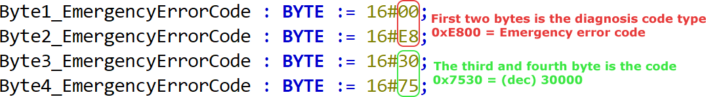

We put these four bytes into an array, which we'll be using as an input to the FB under test once we are going to run our tests.
The test result for the struct that the function block outputs should be `EmergencyErrorCodeDS301` and 30000 (decimal), which is the result defined under the `@TEST-RESULT`.

Next we move to the body of the test suite:

```StructuredText
TEST('WhenEmergencyErrorCodeExpectEmergencyErrorCode');
 
// @TEST-RUN
fbDiagnosticMessageDiagnosticCodeParser(anDiagnosticCodeBuffer := canDiagnosticCodeBuffer_EmergencyErrorCode,
                                        stDiagnosticCode => stDiagnosticCode);
 
// @TEST-ASSERT
AssertEquals(Expected := ceDiagnosticCodeType_EmergencyErrorCode,
             Actual := stDiagnosticCode.eDiagnosticCodeType,
             Message := 'Test $'emergency error code$' failed at $'diagnostic code type$'');
AssertEquals(Expected := cnDiagnosticCode_EmergencyErrorCode,
             Actual := stDiagnosticCode.nCode,
             Message := 'Test $'emergency error code$' failed at $'diagnostic code$'');
 
TEST_FINISHED();
```

What we're doing here is to run the test by calling the function block with our test fixture (defined as an array) as input, and checking (by asserting) whether the result we get in our output is according to our expected test-result.
And that's basically everything there is to it!
If we were to run our code now, the test would fail simply because our function block doesn't do anything as it has not yet been implemented!
Note that we need to finish the method with a call to `TEST_FINISHED()` to indicate to the testing framework that this is the end of the tests.
This gives the possibility to have tests that span over multiple PLC-cycles, as it's possible to have a condition that needs to be reached before calling `TEST_FINISHED()`.
Before doing any implementation code, we need to finish our different test cases so we cover as much scenarios as possible.
What follows are three additional test fixtures and expected test results.

**Test "`WhenManufacturerSpecificExpectManufacturerSpecific`"**

```StructuredText
METHOD PRIVATE WhenManufacturerSpecificExpectManufacturerSpecific
VAR
    fbDiagnosticMessageDiagnosticCodeParser : FB_DiagnosticMessageDiagnosticCodeParser;
    stDiagnosticCode : ST_DIAGNOSTICCODE;
 
    // @TEST-FIXTURE ManuFacturerSpecific
    cnDiagnosticCodeBufferByte1_ManufacturerSpecific : BYTE := 16#00; // 16#E000 (in range of 0xE000 - 0xE7FF)
    cnDiagnosticCodeBufferByte2_ManufacturerSpecific : BYTE := 16#E0;
    cnDiagnosticCodeBufferByte3_ManufacturerSpecific : BYTE := 16#E8; // 16#03E8 = 10#1000
    cnDiagnosticCodeBufferByte4_ManufacturerSpecific : BYTE := 16#03;
    canDiagnosticCodeBuffer_ManufacturerSpecific : ARRAY[1..4] OF BYTE := [
                                                cnDiagnosticCodeBufferByte1_ManufacturerSpecific,
                                                cnDiagnosticCodeBufferByte2_ManufacturerSpecific,
                                                cnDiagnosticCodeBufferByte3_ManufacturerSpecific,
                                                cnDiagnosticCodeBufferByte4_ManufacturerSpecific];
                                                 
    // @TEST-RESULT ManuFacturerSpecific
    ceDiagnosticCodeType_ManufacturerSpecific : E_DIAGNOSTICCODETYPE := E_DIAGNOSTICCODETYPE.ManufacturerSpecific;
    cnDiagnosticCode_ManufacturerSpecific : UINT := 10#1000;
END_VAR
-----------------------------------------------------------
TEST('WhenManufacturerSpecificExpectManufacturerSpecific');
 
// @TEST-RUN
fbDiagnosticMessageDiagnosticCodeParser(anDiagnosticCodeBuffer := canDiagnosticCodeBuffer_ManufacturerSpecific,
                                        stDiagnosticCode => stDiagnosticCode);
 
// @TEST-ASSERT
AssertEquals(Expected := ceDiagnosticCodeType_ManufacturerSpecific,
             Actual := stDiagnosticCode.eDiagnosticCodeType,
             Message := 'Test $'manufacturer specific$' failed at $'diagnostic code type$'');
AssertEquals(Expected := cnDiagnosticCode_ManufacturerSpecific,
             Actual := stDiagnosticCode.nCode,
             Message := 'Test $'manufacturer specific$' failed at $'diagnostic code$'');
 
TEST_FINISHED();

```

**Test "`WhenProfileSpecificExpectProfileSpecific`"**

```StructuredText
METHOD PRIVATE WhenProfileSpecificExpectProfileSpecific
VAR
    fbDiagnosticMessageDiagnosticCodeParser : FB_DiagnosticMessageDiagnosticCodeParser;
    stDiagnosticCode : ST_DIAGNOSTICCODE;
 
    // @TEST-FIXTURE ProfileSpecific
    cnDiagnosticCodeBufferByte1_ProfileSpecific : BYTE := 16#10; // 16#EF10 (in range of 0xEE00 - 0xEFFF)
    cnDiagnosticCodeBufferByte2_ProfileSpecific : BYTE := 16#EF;
    cnDiagnosticCodeBufferByte3_ProfileSpecific : BYTE := 16#FF; // 16#FFFF = 10#65535
    cnDiagnosticCodeBufferByte4_ProfileSpecific : BYTE := 16#FF;
    canDiagnosticCodeBuffer_ProfileSpecific : ARRAY[1..4] OF BYTE := [
                                                cnDiagnosticCodeBufferByte1_ProfileSpecific,
                                                cnDiagnosticCodeBufferByte2_ProfileSpecific,
                                                cnDiagnosticCodeBufferByte3_ProfileSpecific,
                                                cnDiagnosticCodeBufferByte4_ProfileSpecific];
 
    // @TEST-RESULT ProfileSpecific
    ceDiagnosticCodeType_ProfileSpecific : E_DIAGNOSTICCODETYPE := E_DIAGNOSTICCODETYPE.ProfileSpecific;
    cnDiagnosticCode_ProfileSpecific : UINT := 10#65535;
END_VAR
-------------------------------------------------
TEST('WhenProfileSpecificExpectProfileSpecific');
 
// @TEST-RUN
fbDiagnosticMessageDiagnosticCodeParser(anDiagnosticCodeBuffer := canDiagnosticCodeBuffer_ProfileSpecific,
                                        stDiagnosticCode => stDiagnosticCode);
 
// @TEST-ASSERT
AssertEquals(Expected := ceDiagnosticCodeType_ProfileSpecific,
             Actual := stDiagnosticCode.eDiagnosticCodeType,
             Message := 'Test $'profile specific$' failed at $'diagnostic code type$'');
AssertEquals(Expected := cnDiagnosticCode_ProfileSpecific,
             Actual := stDiagnosticCode.nCode,
             Message := 'Test $'profile specific$' failed at $'diagnostic code$'');
 
TEST_FINISHED();
```

**Test "`WhenReservedForFutureUseExpectReservedForFutureUse`"**

```StructuredText
METHOD PRIVATE WhenReservedForFutureUseExpectReservedForFutureUse
VAR
    fbDiagnosticMessageDiagnosticCodeParser : FB_DiagnosticMessageDiagnosticCodeParser;
    stDiagnosticCode : ST_DIAGNOSTICCODE;
 
    // @TEST-FIXTURE ReservedForFutureUse
    cnDiagnosticCodeBufferByte1_ReservedForFutureUse : BYTE := 16#01; // 16#E801 (in range of 0xE801 - 0xEDFF)
    cnDiagnosticCodeBufferByte2_ReservedForFutureUse : BYTE := 16#E8;
    cnDiagnosticCodeBufferByte3_ReservedForFutureUse : BYTE := 16#D9; // 16#3BD9 = 10#15321
    cnDiagnosticCodeBufferByte4_ReservedForFutureUse : BYTE := 16#3B;
    canDiagnosticCodeBuffer_ReservedForFutureUse : ARRAY[1..4] OF BYTE := [
                                                cnDiagnosticCodeBufferByte1_ReservedForFutureUse,
                                                cnDiagnosticCodeBufferByte2_ReservedForFutureUse,
                                                cnDiagnosticCodeBufferByte3_ReservedForFutureUse,
                                                cnDiagnosticCodeBufferByte4_ReservedForFutureUse];
 
    // @TEST-RESULT ReservedForFutureUse
    ceDiagnosticCodeType_ReservedForFutureUse : E_DIAGNOSTICCODETYPE := E_DIAGNOSTICCODETYPE.Unspecified;
    cnDiagnosticCode_ReservedForFutureUse : UINT := 10#15321;
END_VAR
 
TEST('WhenReservedForFutureUseExpectReservedForFutureUse');
 
// @TEST-RUN
fbDiagnosticMessageDiagnosticCodeParser(anDiagnosticCodeBuffer := canDiagnosticCodeBuffer_ReservedForFutureUse,
                                        stDiagnosticCode => stDiagnosticCode);
 
// @TEST-ASSERT
AssertEquals(Expected := ceDiagnosticCodeType_ReservedForFutureUse,
             Actual := stDiagnosticCode.eDiagnosticCodeType,
             Message := 'Test $'reserved for future use$' failed at $'diagnostic code type$'');
AssertEquals(Expected := cnDiagnosticCode_ReservedForFutureUse,
             Actual := stDiagnosticCode.nCode,
             Message := 'Test $'reserved for future use$' failed at $'diagnostic code$'');
 
TEST_FINISHED();
```

We basically cover all the different use cases for the type of diagnosis code.
Notice that the test fixture is a code that according to the ETG1020 specification is "reserved for future use", while our result should be "unspecified".
We should handle all reserved/unknown as "Unspecified", and thus this is what the output of our function block should be.
Every time we run the function block under test, we assert that the output (`stDiagnosticCode`) is equal to our expected `@TEST-RESULT`.

Next we need to make sure to call all the tests in the body of the test suite.

```StructuredText
WhenEmergencyErrorCodeExpectEmergencyErrorCode();
WhenManufacturerSpecificExpectManufacturerSpecific();
WhenProfileSpecificExpectProfileSpecific();
WhenReservedForFutureUseExpectReservedForFutureUse();
```

### FB_DiagnosticMessageFlagsParser_Test

The next function block that we want to write tests for is the one that parses the different flags in the event message.
The tests will follow the same layout as for the previous function block, where we:

- Instantiate the function block under test
- Declare test-fixtures for our tests
- Declare the test-results for the test-fixtures
- Run the tests  

The layout of the two bytes for the flags looks like this:
|Bit|Description|
|-|-|
|0-3|0: Info message, 1: Warning message, 2: Error message, 3-15: Reserved for future use|
|4|Time stamp is a local time stamp|
|5-7|Reserved for future use|
|8-15|Number of parameters in this diagnosis message|

A couple of good tests would be to try every code type (info, warning, error) and with some different combinations of timestamp and amount of parameters.


Let's write four tests and call them:

- `WhenErrorMessageExpectErrorMessageLocalTimestampAndFourParameters`
- `WhenInfoMessageExpectInfoMessageGlobalTimestampAndZeroParameters`
- `WhenReservedForFutureUseMessageExpectReservedForFutureUseMessageLocalTimestampAnd33Parameters`
- `WhenWarningMessageExpectWarningMessageLocalTimestampAndTwoParameters`  

It's a good idea to have descriptive names about what the test is testing and what the expected result is.
In this way any developer reading the tests can clearly understand the goal of the tests.
With all this information other developers get a lot of documentation for free!

**Test "`WhenErrorMessageExpectErrorMessageLocalTimestampAndFourParameters`"**

```StructuredText
METHOD PRIVATE WhenErrorMessageExpectErrorMessageLocalTimestampAndFourParameters
VAR
    fbDiagnosticMessageFlagsParser : FB_DiagnosticMessageFlagsParser;
    stFlags : ST_FLAGS;
 
    // @TEST-FIXTURE ErrorMessage
    cnFlagsBufferByte1_ErrorMessage : BYTE := 2#0001_0010; // Error message and local time stamp
    cnFlagsBufferByte2_ErrorMessage : BYTE := 2#0000_0100; // Four parameters in the diagnosis message
    canFlagsBuffer_ErrorMessage : ARRAY[1..2] OF BYTE := [cnFlagsBufferByte1_ErrorMessage, 
                                                          cnFlagsBufferByte2_ErrorMessage];
    // @TEST-RESULT ErrorMessage
    ceFlags_DiagnosisTypeErrorMessage : E_DIAGNOSISTYPE := E_DIAGNOSISTYPE.ErrorMessage;
    ceFlags_TimeStampTypeLocal : E_TIMESTAMPTYPE := E_TIMESTAMPTYPE.Local;
    cnFlags_NumberOfParametersInDiagnosisMessageFour : USINT := 4;
END_VAR
--------------------------------------------------------------------------
TEST('WhenErrorMessageExpectErrorMessageLocalTimestampAndFourParameters');
 
// @TEST-RUN ErrorMessage
fbDiagnosticMessageFlagsParser(anFlagsBuffer := canFlagsBuffer_ErrorMessage,
                               stFlags => stFlags);
 
// @TEST-ASSERT ErrorMessage
AssertEquals(Expected := ceFlags_DiagnosisTypeErrorMessage,
             Actual := stFlags.eDiagnosisType,
             Message :='Test $'Error message$' failed at $'diagnosis type$'');
AssertEquals(Expected := ceFlags_TimeStampTypeLocal,
             Actual := stFlags.eTimeStampType,
             Message := 'Test $'Error message$' failed at $'timestamp type$'');
AssertEquals(Expected := cnFlags_NumberOfParametersInDiagnosisMessageFour,
             Actual := stFlags.nNumberOfParametersInDiagnosisMessage,
             Message := 'Test $'Error message$' failed at $'number of parameters$'');
 
TEST_FINISHED();
```

**Test "`WhenErrorMessageExpectErrorMessageLocalTimestampAndFourParameters`"**

```StructuredText
METHOD PRIVATE WhenInfoMessageExpectInfoMessageGlobalTimestampAndZeroParameters
VAR
    fbDiagnosticMessageFlagsParser : FB_DiagnosticMessageFlagsParser;
    stFlags : ST_FLAGS;
 
    // @TEST-FIXTURE InfoMessage
    cnFlagsBufferByte1_InfoMessage : BYTE := 2#0000_0000; // Info message and global time stamp
    cnFlagsBufferByte2_InfoMessage : BYTE := 2#0000_0000; // Zero parameters in the diagnosis message
    canFlagsBuffer_InfoMessage : ARRAY[1..2] OF BYTE := [cnFlagsBufferByte1_InfoMessage, 
                                                         cnFlagsBufferByte2_InfoMessage];
    // @TEST-RESULT InfoMessage
    ceFlags_DiagnosisTypeInfoMessage : E_DIAGNOSISTYPE := E_DIAGNOSISTYPE.InfoMessage;
    ceFlags_TimeStampTypeGlobal : E_TIMESTAMPTYPE := E_TIMESTAMPTYPE.Global;
    cnFlags_NumberOfParametersInDiagnosisMessageZero : USINT := 0;
END_VAR
-------------------------------------------------------------------------
TEST('WhenInfoMessageExpectInfoMessageGlobalTimestampAndZeroParameters');
 
// @TEST-RUN
fbDiagnosticMessageFlagsParser(anFlagsBuffer := canFlagsBuffer_InfoMessage,
                               stFlags => stFlags);
 
// @TEST-ASSERT
AssertEquals(Expected := ceFlags_DiagnosisTypeInfoMessage,
             Actual := stFlags.eDiagnosisType,
             Message := 'Test $'Info message$' failed at $'diagnosis type$'');
AssertEquals(Expected := ceFlags_TimeStampTypeGlobal,
             Actual := stFlags.eTimeStampType,
             Message := 'Test $'Info message$' failed at $'timestamp type$'');
AssertEquals(Expected := cnFlags_NumberOfParametersInDiagnosisMessageZero,
             Actual := stFlags.nNumberOfParametersInDiagnosisMessage,
             Message :='Test $'Info message$' failed at $'number of parameters$'');
 
TEST_FINISHED();
```

**Test "`WhenReservedForFutureUseMessageExpectReservedForFutureUseMessageLocalTimestampAnd33Parameters`"**

```StructuredText
METHOD PRIVATE WhenReservedForFutureUseMessageExpectReservedForFutureUseMessageLocalTimestampAnd33Parameters
VAR
    fbDiagnosticMessageFlagsParser : FB_DiagnosticMessageFlagsParser;
    stFlags : ST_FLAGS;
 
    // @TEST-FIXTURE ReservedForFutureUseMessage
    cnFlagsBufferByte1_ReservedForFutureUseMessage : BYTE := 2#0001_0011; // ReservedForFutureUse message and local time stamp
    cnFlagsBufferByte2_ReservedForFutureUseMessage : BYTE := 2#0010_0001; // 33 parameters in the diagnosis message
    canFlagsBuffer_ReservedForFutureUseMessage : ARRAY[1..2] OF BYTE := [cnFlagsBufferByte1_ReservedForFutureUseMessage, 
                                                                         cnFlagsBufferByte2_ReservedForFutureUseMessage];
    // @TEST-RESULT ReservedForFutureUseMessage
    ceFlags_DiagnosisTypeReservedForFutureUseMessage : E_DIAGNOSISTYPE := E_DIAGNOSISTYPE.Unspecified;
    cnFlags_NumberOfParametersInDiagnosisMessage33 : USINT := 33;
    ceFlags_TimeStampTypeLocal : E_TIMESTAMPTYPE := E_TIMESTAMPTYPE.Local;
END_VAR
------------------------------------------------------------------------------------------------------
TEST('WhenReservedForFutureUseMessageExpectReservedForFutureUseMessageLocalTimestampAnd33Parameters');
 
// @TEST-RUN ReservedForFutureUseMessage
fbDiagnosticMessageFlagsParser(anFlagsBuffer := canFlagsBuffer_ReservedForFutureUseMessage,
                               stFlags => stFlags);
 
// @TEST-ASSERT ReservedForFutureUseMessage
AssertEquals(Expected := ceFlags_DiagnosisTypeReservedForFutureUseMessage,
             Actual := stFlags.eDiagnosisType,
             Message := 'Test $'Reserved for future use message$' failed at $'diagnosis type$'');
AssertEquals(Expected := ceFlags_TimeStampTypeLocal,
             Actual := stFlags.eTimeStampType,
             Message := 'Test $'Reserved for future use message$' failed at $'timestamp type$'');
AssertEquals(Expected := cnFlags_NumberOfParametersInDiagnosisMessage33,
             Actual := stFlags.nNumberOfParametersInDiagnosisMessage,
             Message := 'Test $'Reserved for future use message$' failed at $'number of parameters$'');
 
TEST_FINISHED();
```

**Test "`WhenWarningMessageExpectWarningMessageLocalTimestampAndTwoParameters`"**

```StructuredText
METHOD PRIVATE WhenWarningMessageExpectWarningMessageLocalTimestampAndTwoParameters
VAR
    fbDiagnosticMessageFlagsParser : FB_DiagnosticMessageFlagsParser;
    stFlags : ST_FLAGS;
 
    // @TEST-FIXTURE WarningMessage
    cnFlagsBufferByte1_WarningMessage : BYTE := 2#0001_0001; // Warning message and local time stamp
    cnFlagsBufferByte2_WarningMessage : BYTE := 2#0000_0010; // Two parameters in the diagnosis message
    canFlagsBuffer_WarningMessage : ARRAY[1..2] OF BYTE := [cnFlagsBufferByte1_WarningMessage, 
                                                            cnFlagsBufferByte2_WarningMessage];
    // @TEST-RESULT WarningMessage
    ceFlags_DiagnosisTypeWarningMessage : E_DIAGNOSISTYPE := E_DIAGNOSISTYPE.WarningMessage;
    ceFlags_TimeStampTypeLocal : E_TIMESTAMPTYPE := E_TIMESTAMPTYPE.Local;
    cnFlags_NumberOfParametersInDiagnosisMessageTwo : USINT := 2;
END_VAR
-----------------------------------------------------------------------------
TEST('WhenWarningMessageExpectWarningMessageLocalTimestampAndTwoParameters');
 
// @TEST-RUN WarningMessage
fbDiagnosticMessageFlagsParser(anFlagsBuffer := canFlagsBuffer_WarningMessage,
                               stFlags => stFlags);
 
// @TEST-ASSERT WarningMessage
AssertEquals(Expected := ceFlags_DiagnosisTypeWarningMessage,
             Actual := stFlags.eDiagnosisType,
             Message := 'Test $'Warning message$' failed at $'diagnosis type$'');
AssertEquals(Expected := ceFlags_TimeStampTypeLocal,
             Actual := stFlags.eTimeStampType,
             Message := 'Test $'Warning message$' failed at $'timestamp type$'');
AssertEquals(Expected := cnFlags_NumberOfParametersInDiagnosisMessageTwo,
             Actual := stFlags.nNumberOfParametersInDiagnosisMessage,
             Message := 'Test $'Warning message$' failed at $'number of parameters$'');
 
TEST_FINISHED();
```

We differentiate between the different tests by changing the contents of the two bytes defining the flags-parameter.
By changing the first four bits of the first byte, we change the diagnosis type (info, warning, error, unspecified).
To verify that our code outputs a diagnosis type of unspecified, we need to make sure that the first four bits of the first byte have a value of 4-15 (decimal), which is reserved for future use.
This is what is done in the fourth text fixture.
Finally we need to call the function block under test with all the test fixtures and assert the result for each and one of them, just like we did for the diagnosis code function block previously.

```StructuredText
FUNCTION_BLOCK FB_DiagnosticMessageFlagsParser_Test EXTENDS TcUnit.FB_TestSuite
```

And as usual, we need to add a call to all the test-methods in the body of the test suite.

```StructuredText
TestWithEmergencyMessage();
TestWithManufacturerSpecificMessage();
TestWithUnspecifiedMessageMessage();
TestWithUnspecifiedMessageMessage_ParameterVariant();
```

What we've got left is to create test cases for the parsing of the text identity and the timestamp of the diagnostic event.
Then we also want to have a few tests that closes the loop and verifies the parsing of a complete diagnosis history message.

### FB_DiagnosticMessageTextIdentityParser_Test

The only input for the text identity are two bytes that together make up an unsigned integer (0-65535), which is the result (output) of this parser.
It's enough to make three test cases; one for low/medium/max.
We accomplish to test the three values by changing the two bytes that make up the unsigned integer.
The header of the test suite:

```StructuredText
FUNCTION_BLOCK FB_DiagnosticMessageTextIdentityParser_Test EXTENDS TcUnit.FB_TestSuite
```

We'll write the tests Low/Med/High, testing for the different inputs 0, 34500 and 65535.

**Test "`WhenTextIdentityLowExpectTextIdentity0`"**

```StructuredText
METHOD PRIVATE WhenTextIdentityLowExpectTextIdentity0
VAR
    fbDiagnosticMessageTextIdentityParser : FB_DiagnosticMessageTextIdentityParser;
    nTextIdentity : UINT;
 
    // @TEST-FIXTURE TextIdentity#Low
    cnTextIdentityBufferByte1_IdentityLow : BYTE := 16#00; // 0 = no text identity
    cnTextIdentityBufferByte2_IdentityLow : BYTE := 16#00;
    canTextIdentityBuffer_IdentityLow : ARRAY[1..2] OF BYTE := [cnTextIdentityBufferByte1_IdentityLow,
                                                                cnTextIdentityBufferByte2_IdentityLow];
    // @TEST-RESULT TextIdentity#Low
    cnTextIdentity_IdentityLow : UINT := 0;
END_VAR
----------------------------------------------- 
TEST('WhenTextIdentityLowExpectTextIdentity0');
 
// @TEST-RUN
fbDiagnosticMessageTextIdentityParser(anTextIdentityBuffer := canTextIdentityBuffer_IdentityLow,
                                      nTextIdentity => nTextIdentity);
// @TEST-ASSERT
Assert.AssertEquals(Expected := cnTextIdentity_IdentityLow,
                    Actual := nTextIdentity,
                    Message := 'Test $'TextIdentity#Low$' failed');
 
TEST_FINISHED();
```

**Test "`WhenTextIdentityMedExpectTextIdentity34500`"**

```StructuredText
METHOD PRIVATE WhenTextIdentityMedExpectTextIdentity34500
VAR
    fbDiagnosticMessageTextIdentityParser : FB_DiagnosticMessageTextIdentityParser;
    nTextIdentity : UINT;
 
    // @TEST-FIXTURE TextIdentity#Med
    cnTextIdentityBufferByte1_IdentityMed : BYTE := 16#C4; // 0x86C4 = 34500
    cnTextIdentityBufferByte2_IdentityMed : BYTE := 16#86;
    canTextIdentityBuffer_IdentityMed : ARRAY[1..2] OF BYTE := [cnTextIdentityBufferByte1_IdentityMed,
                                                                cnTextIdentityBufferByte2_IdentityMed];
    // @TEST-RESULT TextIdentity#Med
    cnTextIdentity_IdentityMed : UINT := 34500;
END_VAR
---------------------------------------------------
TEST('WhenTextIdentityMedExpectTextIdentity34500');
 
// @TEST-RUN
fbDiagnosticMessageTextIdentityParser(anTextIdentityBuffer := canTextIdentityBuffer_IdentityMed,
                                      nTextIdentity => nTextIdentity);
// @TEST-ASSERT
AssertEquals(Expected := cnTextIdentity_IdentityMed,
             Actual := nTextIdentity,
             Message := 'Test $'TextIdentity#Med$' failed');
 
TEST_FINISHED();
```

**Test "`WhenTextIdentityHighExpectTextIdentity65535`"**

```StructuredText
METHOD PRIVATE WhenTextIdentityHighExpectTextIdentity65535
VAR
    fbDiagnosticMessageTextIdentityParser : FB_DiagnosticMessageTextIdentityParser;
    nTextIdentity : UINT;
 
    // @TEST-FIXTURE TextIdentity#High
    cnTextIdentityBufferByte1_IdentityHigh : BYTE := 16#FF; // 0xFFFF = 65535
    cnTextIdentityBufferByte2_IdentityHigh : BYTE := 16#FF;
    canTextIdentityBuffer_IdentityHigh : ARRAY[1..2] OF BYTE := [cnTextIdentityBufferByte1_IdentityHigh,
                                                                 cnTextIdentityBufferByte2_IdentityHigh];
    // @TEST-RESULT TextIdentity#High
    cnTextIdentity_IdentityHigh : UINT := 65535;
END_VAR
----------------------------------------------------
TEST('WhenTextIdentityHighExpectTextIdentity65535');
 
// @TEST-RUN
fbDiagnosticMessageTextIdentityParser(anTextIdentityBuffer := canTextIdentityBuffer_IdentityHigh,
                                      nTextIdentity => nTextIdentity);
// @TEST-ASSERT
AssertEquals(Expected := cnTextIdentity_IdentityHigh,
             Actual := nTextIdentity,
             Message := 'Test $'TextIdentity#High$' failed');
 
TEST_FINISHED();

```StructuredText
As can be seen the only thing that varies between the tests (other than name) is the different inputs and expected output.

### FB_DiagnosticMessageTimeStampParser_Test

The eight bytes that make up the timestamp can be either the distributed clock (DC) from EtherCAT, or a local clock in the device itself.
In the global case we want to parse the DC-time, while in the local case we just want to take the DC from the current task time (the local clock could be extracted from the EtherCAT-slave, but for the sake of simplicity we'll use the task DC).
Because the local/global-flag is read from the "Flags"-FB, this information needs to be provided into the timestamp-FB, and is therefore an input to the FB.
What this means is that if the timestamp is local, the eight bytes don't matter as we'll get the time from the task.
For the timestamp-FB it's enough with two test cases, one testing it with a local timestamp and the other with a global timestamp.
The local timestamp unit test result has to be created in runtime.

```StructuredText
FUNCTION_BLOCK FB_DiagnosticMessageTimeStampParser_Test EXTENDS TcUnit.FB_TestSuite
```

Let's create our tests, and start with the test * **"`TestWithTimestampZeroTimeExpectCurrentTime`"**.

```StructuredText
METHOD PRIVATE TestWithTimestampZeroTimeExpectCurrentTime
VAR
    fbDiagnosticMessageTimeStampParser : FB_DiagnosticMessageTimeStampParser;
    sTimeStamp : STRING(29);
 
    nCurrentDcTaskTime : Tc2_EtherCAT.T_DCTIME64;
    sCurrentDcTaskTimeString : STRING(29);
 
    // @TEST-FIXTURE time stamp zero time
    canTimeStampBuffer_TimeStampZeroTime : ARRAY[1..8] OF BYTE := [8(16#00)];
END_VAR
---------------------------------------------------
TEST('TestWithTimestampZeroTimeExpectCurrentTime');
 
// @TEST-RUN
fbDiagnosticMessageTimeStampParser(anTimeStampBuffer := canTimeStampBuffer_TimeStampZeroTime,
                                   sTimeStamp => sTimeStamp);
nCurrentDcTaskTime := Tc2_EtherCAT.F_GetCurDcTaskTime64();
sCurrentDcTaskTimeString := DCTIME64_TO_STRING(in := nCurrentDcTaskTime);
 
// @TEST-ASSERT
AssertEquals(Expected := sCurrentDcTaskTimeString,
             Actual := sTimeStamp,
             Message := 'Test $'TimeStamp zero time$' failed');
 
TEST_FINISHED();
```

**Test "`TestWithValidTimestampExpectSameTimestamp`"**

```StructuredText
METHOD PRIVATE TestWithValidTimestampExpectSameTimestamp
VAR
    fbDiagnosticMessageTimeStampParser : FB_DiagnosticMessageTimeStampParser;
    sTimeStamp : STRING(29);
 
    // @TEST-FIXTURE TimeStamp valid time
    cnTimeStampBufferByte1_TimeStampValidTime : BYTE := 16#C0; // 0x07C76560A71025C0 = '2017-10-05-14:15:44.425035200'
    cnTimeStampBufferByte2_TimeStampValidTime : BYTE := 16#25;
    cnTimeStampBufferByte3_TimeStampValidTime : BYTE := 16#10;
    cnTimeStampBufferByte4_TimeStampValidTime : BYTE := 16#A7;
    cnTimeStampBufferByte5_TimeStampValidTime : BYTE := 16#60;
    cnTimeStampBufferByte6_TimeStampValidTime : BYTE := 16#65;
    cnTimeStampBufferByte7_TimeStampValidTime : BYTE := 16#C7;
    cnTimeStampBufferByte8_TimeStampValidTime : BYTE := 16#07;
    canTimeStampBuffer_TimeStampValidTime : ARRAY[1..8] OF BYTE := [cnTimeStampBufferByte1_TimeStampValidTime,
                                                                    cnTimeStampBufferByte2_TimeStampValidTime,
                                                                    cnTimeStampBufferByte3_TimeStampValidTime,
                                                                    cnTimeStampBufferByte4_TimeStampValidTime,
                                                                    cnTimeStampBufferByte5_TimeStampValidTime,
                                                                    cnTimeStampBufferByte6_TimeStampValidTime,
                                                                    cnTimeStampBufferByte7_TimeStampValidTime,
                                                                    cnTimeStampBufferByte8_TimeStampValidTime];
    // @TEST-RESULT TimeStamp valid time
    csTimeStamp_TimeStampValidTime : STRING(29) := '2017-10-05-14:15:44.425035200'; // T_DCTime64 = 16#07C76560A71025C0
END_VAR
--------------------------------------------------
TEST('TestWithValidTimestampExpectSameTimestamp');
 
// @TEST-RUN
fbDiagnosticMessageTimeStampParser(anTimeStampBuffer := canTimeStampBuffer_TimeStampValidTime,
                                   sTimeStamp => sTimeStamp);
 
// @TEST-ASSERT
AssertEquals(Expected := csTimeStamp_TimeStampValidTime,
             Actual := sTimeStamp,
             Message := 'Test $'TimeStamp zero time$' failed');
 
TEST_FINISHED();
```

For the local timestamp case, we can see that we setup the test-fixture for the eight bytes to zeros, as this data is not necessary for the local timestamp case.
For the global timestamp test-fixture, we created eight bytes of data representing the date/time “2017-10-05-14:15:44.425035200”.
As our timestamp-FB returns a string, this is exactly the string that we expect to get as a test-result.
You might be asking yourself "how on earth is it possible to know that 0x07C76560A71025C0 equals 2017-10-05-14:15:44.425035200"?
This can be accomplished by creating a little program that just prints the current actual DC-time by using [`F_GetActualDCTime64()`](https://infosys.beckhoff.com/english.php?content=../content/1033/tcplclib_tc2_ethercat/2268416395.html&id=) in combination with [`DCTIME64_TO_STRING()`](https://infosys.beckhoff.com/english.php?content=../content/1033/tcplclib_tc2_ethercat/2267406347.html&id=6169424304031718909).
Because the `T_DCTIME64`-type that is returned from `F_GetActualDcTime64()` is an alias for a primitive type, it's easy to convert it into a byte-array.
Note that the assertion of the local time stamp is based on getting the current DC-task time by utilizing the [`F_GetCurDcTaskTime64()`](https://infosys.beckhoff.com/index.php?content=../content/1031/tcplclib_tc2_ethercat/2268414091.html&id=), thus we're making sure that if the diagnosis message tells us that the timestamp is a local clock, we check that our FB returns this.

### FB_DiagnosticMessageParser_Test

The final test-FB that we need is the one that ties the bag together and uses all the other four.
The `FB_DiagnosticMessageParser` function block will be the one where we send in all the bytes that we receive from the IO-Link master, and that will output the struct that we can present to the operator or send further up in the chain.
One could argue that because we already have unit tests for the other four function blocks, we don't need to have unit tests for this one.
By having unit tests for this "umbrella" function block, we add an additional level of confidence that our code is working properly.
Additionally, we can also make sure that combinations of different diagnosis messages are parsed correctly.

To have maximum variation we want to try to vary all parameters as much as possible.
Because it's quite a lot of code, it's highly recommended to look at the code in your development environment in parallell.
The code is available on [GitHub](https://github.com/tcunit/ExampleProjects/tree/master/AdvancedExampleProject).
We'll go through all the details, thus it should thus be easy for you to add any test cases that you find necessary.
As usual, header first:

```StructuredText
FUNCTION_BLOCK FB_DiagnosticMessageParser_Test EXTENDS TcUnit.FB_TestSuite
```

The function block ´FB_DiagnosticMessageParser is a very simple FB that compares every data element of the struct ´ST_DIAGNOSTICMESSAGE´, which we'll later use when we're doing the assertion.
We want to make sure to test various types of diagnostic messages, with their complete content. We'll write four tests:

- One test with an emergency message
- One test with a manufacturer specific message
- Two tests with unspecified messages (two variants)

Because this function uses the other four function blocks, we need to create a complete structure for every test with the complete content of a diagnosis message, making the tests prerequisites for every test quite large.
We'll start with the test **`TestWithEmergencyMessage`**.

```StructuredText
METHOD PRIVATE TestWithEmergencyMessage
VAR  
    fbDiagnosticMessageParser : FB_DiagnosticMessageParser;
    aDiagnosticMessageBuffer : ARRAY[1..28] OF BYTE;
    stDiagnosticMessage : ST_DIAGNOSTICMESSAGE;
 
    // @TEST-RESULT EmergencyMessage
    stDiagnosticMessage_EmergencyMessage : ST_DIAGNOSTICMESSAGE :=
        (stDiagnosticCode := (eDiagnosticCodeType := E_DIAGNOSTICCODETYPE.EmergencyErrorCodeDS301, nCode := 0),
        stFlags := (eDiagnosisType := E_DIAGNOSISTYPE.ErrorMessage, eTimeStampType := E_TIMESTAMPTYPE.Local,
                    nNumberOfParametersInDiagnosisMessage := 0),
        nTextIdentityReferenceToESIFile := 0,
        sTimeStamp := '');  // Local time stamp, will be updated in program call to current task time;
 
    // @TEST-FIXTURE EmergencyMessage
    cnDiagnosticBufferByte1_EmergencyMessage : BYTE := 16#00; // 0xE800 = Emergency code
    cnDiagnosticBufferByte2_EmergencyMessage : BYTE := 16#E8;
    cnDiagnosticBufferByte3_EmergencyMessage : BYTE := 16#00; // 0x0000 = Code 0
    cnDiagnosticBufferByte4_EmergencyMessage : BYTE := 16#00;
    cnDiagnosticBufferByte5_EmergencyMessage : BYTE := 2#0001_0010; // Local time stamp &amp;amp;amp; error message 
    cnDiagnosticBufferByte6_EmergencyMessage : BYTE := 16#00; // Number of parameters = 0
    cnDiagnosticBufferByte7_EmergencyMessage : BYTE := 16#00; // 0x0000, Text id as reference to ESI file = 0
    cnDiagnosticBufferByte8_EmergencyMessage : BYTE := 16#00;
    cnDiagnosticBufferByte9_16_EmergencyMessage : BYTE := 16#00; // Timestamp (none attached)
    cnDiagnosticBufferByte17_EmergencyMessage : BYTE := 2#0000_0010; // Param1 = Signed8
    cnDiagnosticBufferByte18_EmergencyMessage : BYTE := 2#0000_0000;
    cnDiagnosticBufferByte19_EmergencyMessage : BYTE := 2#0000_0011; // Port 3
    cnDiagnosticBufferByte20_EmergencyMessage : BYTE := 2#0000_0011; // Param2 = Signed16
    cnDiagnosticBufferByte21_EmergencyMessage : BYTE := 2#0000_0000;
    cnDiagnosticBufferByte22_EmergencyMessage : BYTE := 2#1110_1000; // EventCode = 10#1000
    cnDiagnosticBufferByte23_EmergencyMessage : BYTE := 2#0000_0011;
    cnDiagnosticBufferByte24_EmergencyMessage : BYTE := 2#0000_0010; // Param3 = Signed8
    cnDiagnosticBufferByte25_EmergencyMessage : BYTE := 2#0000_0000;
    cnDiagnosticBufferByte26_EmergencyMessage : BYTE := 2#0001_0111; // Qualifier: Instance=Reserved_7, Source=Device, Type=Notification, Mode=Reserved
    cnDiagnosticBufferByte27_EmergencyMessage : BYTE := 2#0000_0000;
    cnDiagnosticBufferByte28_EmergencyMessage : BYTE := 2#0000_0000;
 
    canDiagnosticBuffer_EmergencyMessage : ARRAY[1..28] OF BYTE := [cnDiagnosticBufferByte1_EmergencyMessage,
                                                                    cnDiagnosticBufferByte2_EmergencyMessage,
                                                                    cnDiagnosticBufferByte3_EmergencyMessage,
                                                                    cnDiagnosticBufferByte4_EmergencyMessage,
                                                                    cnDiagnosticBufferByte5_EmergencyMessage,
                                                                    cnDiagnosticBufferByte6_EmergencyMessage,
                                                                    cnDiagnosticBufferByte7_EmergencyMessage,
                                                                    cnDiagnosticBufferByte8_EmergencyMessage,
                                                                    8(cnDiagnosticBufferByte9_16_EmergencyMessage),
                                                                    cnDiagnosticBufferByte17_EmergencyMessage,
                                                                    cnDiagnosticBufferByte18_EmergencyMessage,
                                                                    cnDiagnosticBufferByte19_EmergencyMessage,
                                                                    cnDiagnosticBufferByte20_EmergencyMessage,
                                                                    cnDiagnosticBufferByte21_EmergencyMessage,
                                                                    cnDiagnosticBufferByte22_EmergencyMessage,
                                                                    cnDiagnosticBufferByte23_EmergencyMessage,
                                                                    cnDiagnosticBufferByte24_EmergencyMessage,
                                                                    cnDiagnosticBufferByte25_EmergencyMessage,
                                                                    cnDiagnosticBufferByte26_EmergencyMessage,
                                                                    cnDiagnosticBufferByte27_EmergencyMessage,
                                                                    cnDiagnosticBufferByte28_EmergencyMessage];
END_VAR
---------------------------------
TEST('TestWithEmergencyMessage');
 
// @TEST-RUN
stDiagnosticMessage_EmergencyMessage.sTimeStamp := DCTIME64_TO_STRING(in := F_GetCurDcTaskTime64());
 
fbDiagnosticMessageParser(anDiagnosticMessageBuffer := canDiagnosticBuffer_EmergencyMessage,
                          stDiagnosticMessage => stDiagnosticMessage);
 
// @TEST-ASSERT
AssertEquals(Expected := stDiagnosticMessage_EmergencyMessage.stDiagnosticCode.eDiagnosticCodeType,
             Actual := stDiagnosticMessage.stDiagnosticCode.eDiagnosticCodeType,
             Message := 'Test $'EmergencyMessage$' failed at $'Diagnostic code type$'');
AssertEquals(Expected := stDiagnosticMessage_EmergencyMessage.stDiagnosticCode.nCode,
             Actual := stDiagnosticMessage.stDiagnosticCode.nCode,
             Message := 'Test $'EmergencyMessage$' failed at $'Diagnostic code$'');
AssertEquals(Expected := stDiagnosticMessage_EmergencyMessage.stFlags.eDiagnosisType,
             Actual := stDiagnosticMessage.stFlags.eDiagnosisType,
             Message := 'Test $'EmergencyMessage$' failed at $'Diagnosis type$'');
AssertEquals(Expected := stDiagnosticMessage_EmergencyMessage.stFlags.eTimeStampType,
             Actual := stDiagnosticMessage.stFlags.eTimeStampType,
             Message := 'Test $'EmergencyMessage$' failed at $'Timestamp type$'');
AssertEquals(Expected := stDiagnosticMessage_EmergencyMessage.stFlags.nNumberOfParametersInDiagnosisMessage,
             Actual := stDiagnosticMessage.stFlags.nNumberOfParametersInDiagnosisMessage,
             Message := 'Test $'EmergencyMessage$' failed at $'Numbers of parameters in diagnosis message$'');
AssertEquals(Expected := stDiagnosticMessage_EmergencyMessage.nTextIdentityReferenceToESIFile,
             Actual := stDiagnosticMessage.nTextIdentityReferenceToESIFile,
             Message := 'Test $'EmergencyMessage$' failed at $'Text identity reference to ESI file$'');
AssertEquals(Expected := stDiagnosticMessage_EmergencyMessage.sTimeStamp,
             Actual := stDiagnosticMessage.sTimeStamp,
             Message := 'Test $'EmergencyMessage$' failed at $'Timestamp$'');
 
TEST_FINISHED();
```

Next up is testcase **`TestWithManufacturerSpecificMessage`**

```StructuredText
METHOD PRIVATE TestWithManufacturerSpecificMessage
VAR
    fbDiagnosticMessageParser : FB_DiagnosticMessageParser;
    aDiagnosticMessageBuffer : ARRAY[1..28] OF BYTE;
    stDiagnosticMessage : ST_DIAGNOSTICMESSAGE;
 
    // @TEST-FIXTURE ManufacturerSpecificMessage
    cnDiagnosticBufferByte1_ManufacturerSpecificMessage : BYTE := 16#90; // 0xE290 = Manufacturer Specific
    cnDiagnosticBufferByte2_ManufacturerSpecificMessage : BYTE := 16#E2;
    cnDiagnosticBufferByte3_ManufacturerSpecificMessage : BYTE := 16#30; // 0x0000 = Code 0
    cnDiagnosticBufferByte4_ManufacturerSpecificMessage : BYTE := 16#75;
    cnDiagnosticBufferByte5_ManufacturerSpecificMessage : BYTE := 2#0000_0000; // Global time stamp &amp;amp;amp; info message 
    cnDiagnosticBufferByte6_ManufacturerSpecificMessage : BYTE := 16#02; // Number of parameters = 2
    cnDiagnosticBufferByte7_ManufacturerSpecificMessage : BYTE := 16#A8; // 0x61A8, Text id as reference to ESI file = 10#25000
    cnDiagnosticBufferByte8_ManufacturerSpecificMessage : BYTE := 16#61;
    cnDiagnosticBufferByte9_ManufacturerSpecificMessage : BYTE := 16#C8; // Timestamp from DC clock, 16#07C8D11492616FC8 = '2017-10-10-05:20:39.893037000'
    cnDiagnosticBufferByte10_ManufacturerSpecificMessage : BYTE := 16#6F;
    cnDiagnosticBufferByte11_ManufacturerSpecificMessage : BYTE := 16#61;
    cnDiagnosticBufferByte12_ManufacturerSpecificMessage : BYTE := 16#92;
    cnDiagnosticBufferByte13_ManufacturerSpecificMessage : BYTE := 16#14;
    cnDiagnosticBufferByte14_ManufacturerSpecificMessage : BYTE := 16#D1;
    cnDiagnosticBufferByte15_ManufacturerSpecificMessage : BYTE := 16#C8;
    cnDiagnosticBufferByte16_ManufacturerSpecificMessage : BYTE := 16#07;
    cnDiagnosticBufferByte17_ManufacturerSpecificMessage : BYTE := 2#0000_0010; // Param1 = Signed8
    cnDiagnosticBufferByte18_ManufacturerSpecificMessage : BYTE := 2#0000_0000;
    cnDiagnosticBufferByte19_ManufacturerSpecificMessage : BYTE := 2#0000_0110; // Port 6
    cnDiagnosticBufferByte20_ManufacturerSpecificMessage : BYTE := 2#0000_0011; // Param2 = Signed16
    cnDiagnosticBufferByte21_ManufacturerSpecificMessage : BYTE := 2#0000_0000;
    cnDiagnosticBufferByte22_ManufacturerSpecificMessage : BYTE := 2#1101_0010; // EventCode = 10#1234
    cnDiagnosticBufferByte23_ManufacturerSpecificMessage : BYTE := 2#0000_0100;
    cnDiagnosticBufferByte24_ManufacturerSpecificMessage : BYTE := 2#0000_0010; // Param3 = Signed8
    cnDiagnosticBufferByte25_ManufacturerSpecificMessage : BYTE := 2#0000_0000;
    cnDiagnosticBufferByte26_ManufacturerSpecificMessage : BYTE := 2#0100_0110; // Qualifier: Instance=Reserved_6, Source=Device, Type=Reserved, Mode=EventSingleShot
    cnDiagnosticBufferByte27_ManufacturerSpecificMessage : BYTE := 2#0000_0000;
    cnDiagnosticBufferByte28_ManufacturerSpecificMessage : BYTE := 2#0000_0000;
 
    canDiagnosticBuffer_ManufacturerSpecificMessage : ARRAY[1..28] OF BYTE := [
                                                               cnDiagnosticBufferByte1_ManufacturerSpecificMessage,
                                                               cnDiagnosticBufferByte2_ManufacturerSpecificMessage,
                                                               cnDiagnosticBufferByte3_ManufacturerSpecificMessage,
                                                               cnDiagnosticBufferByte4_ManufacturerSpecificMessage,
                                                               cnDiagnosticBufferByte5_ManufacturerSpecificMessage,
                                                               cnDiagnosticBufferByte6_ManufacturerSpecificMessage,
                                                               cnDiagnosticBufferByte7_ManufacturerSpecificMessage,
                                                               cnDiagnosticBufferByte8_ManufacturerSpecificMessage,
                                                               cnDiagnosticBufferByte9_ManufacturerSpecificMessage,
                                                               cnDiagnosticBufferByte10_ManufacturerSpecificMessage,
                                                               cnDiagnosticBufferByte11_ManufacturerSpecificMessage,
                                                               cnDiagnosticBufferByte12_ManufacturerSpecificMessage,
                                                               cnDiagnosticBufferByte13_ManufacturerSpecificMessage,
                                                               cnDiagnosticBufferByte14_ManufacturerSpecificMessage,
                                                               cnDiagnosticBufferByte15_ManufacturerSpecificMessage,
                                                               cnDiagnosticBufferByte16_ManufacturerSpecificMessage,
                                                               cnDiagnosticBufferByte17_ManufacturerSpecificMessage,
                                                               cnDiagnosticBufferByte18_ManufacturerSpecificMessage,
                                                               cnDiagnosticBufferByte19_ManufacturerSpecificMessage,
                                                               cnDiagnosticBufferByte20_ManufacturerSpecificMessage,
                                                               cnDiagnosticBufferByte21_ManufacturerSpecificMessage,
                                                               cnDiagnosticBufferByte22_ManufacturerSpecificMessage,
                                                               cnDiagnosticBufferByte23_ManufacturerSpecificMessage,
                                                               cnDiagnosticBufferByte24_ManufacturerSpecificMessage,
                                                               cnDiagnosticBufferByte25_ManufacturerSpecificMessage,
                                                               cnDiagnosticBufferByte26_ManufacturerSpecificMessage,
                                                               cnDiagnosticBufferByte27_ManufacturerSpecificMessage,
                                                               cnDiagnosticBufferByte28_ManufacturerSpecificMessage];
 
    // @TEST-RESULT ManufacturerSpecificMessage
    cstDiagnosticMessage_ManufacturerSpecificMessage : ST_DIAGNOSTICMESSAGE :=
        (stDiagnosticCode := (eDiagnosticCodeType := E_DIAGNOSTICCODETYPE.ManufacturerSpecific, nCode := 30000),
        stFlags := (eDiagnosisType := E_DIAGNOSISTYPE.InfoMessage, eTimeStampType := E_TIMESTAMPTYPE.Global,
                    nNumberOfParametersInDiagnosisMessage := 2),
        nTextIdentityReferenceToESIFile := 25000,
        sTimeStamp := '2017-10-10-05:20:39.893037000');
END_VAR
--------------------------------------------
TEST('TestWithManufacturerSpecificMessage');
 
// @TEST-RUN
fbDiagnosticMessageParser(anDiagnosticMessageBuffer := canDiagnosticBuffer_ManufacturerSpecificMessage,
                          stDiagnosticMessage => stDiagnosticMessage);
 
// @TEST-ASSERT
AssertEquals(Expected := cstDiagnosticMessage_ManufacturerSpecificMessage.stDiagnosticCode.eDiagnosticCodeType,
             Actual := stDiagnosticMessage.stDiagnosticCode.eDiagnosticCodeType,
             Message := 'Test $'ManufacturerSpecificMessage$' failed at $'Diagnostic code type$'');
AssertEquals(Expected := cstDiagnosticMessage_ManufacturerSpecificMessage.stDiagnosticCode.nCode,
             Actual := stDiagnosticMessage.stDiagnosticCode.nCode,
             Message := 'Test $'ManufacturerSpecificMessage$' failed at $'Diagnostic code$'');
AssertEquals(Expected := cstDiagnosticMessage_ManufacturerSpecificMessage.stFlags.eDiagnosisType,
             Actual := stDiagnosticMessage.stFlags.eDiagnosisType,
             Message := 'Test $'ManufacturerSpecificMessage$' failed at $'Diagnosis type$'');
AssertEquals(Expected := cstDiagnosticMessage_ManufacturerSpecificMessage.stFlags.eTimeStampType,
             Actual := stDiagnosticMessage.stFlags.eTimeStampType,
             Message := 'Test $'ManufacturerSpecificMessage$' failed at $'Timestamp type$'');
AssertEquals(Expected := cstDiagnosticMessage_ManufacturerSpecificMessage.stFlags.nNumberOfParametersInDiagnosisMessage,
             Actual := stDiagnosticMessage.stFlags.nNumberOfParametersInDiagnosisMessage,
             Message := 'Test $'ManufacturerSpecificMessage$' failed at $'Numbers of parameters in diagnosis message$'');
AssertEquals(Expected := cstDiagnosticMessage_ManufacturerSpecificMessage.nTextIdentityReferenceToESIFile,
             Actual := stDiagnosticMessage.nTextIdentityReferenceToESIFile,
             Message := 'Test $'ManufacturerSpecificMessage$' failed at $'Text identity reference to ESI file$'');
AssertEquals(Expected := cstDiagnosticMessage_ManufacturerSpecificMessage.sTimeStamp,
             Actual := stDiagnosticMessage.sTimeStamp,
             Message := 'Test $'ManufacturerSpecificMessage$' failed at $'Timestamp$'');
 
TEST_FINISHED();
```

And finally two test cases where the diagnosis type is unspecified.

```StructuredText
METHOD PRIVATE TestWithUnspecifiedMessageMessage
VAR
    fbDiagnosticMessageParser : FB_DiagnosticMessageParser;
    aDiagnosticMessageBuffer : ARRAY[1..28] OF BYTE;
    stDiagnosticMessage : ST_DIAGNOSTICMESSAGE;
 
    // @TEST-FIXTURE UnspecifiedMessage
    cnDiagnosticBufferByte1_UnspecifiedMessage : BYTE := 16#01; // 0xE801 = Reserved for future use
    cnDiagnosticBufferByte2_UnspecifiedMessage : BYTE := 16#E8;
    cnDiagnosticBufferByte3_UnspecifiedMessage : BYTE := 16#FF; // 0xFFFF = Code 65535
    cnDiagnosticBufferByte4_UnspecifiedMessage : BYTE := 16#FF;
    cnDiagnosticBufferByte5_UnspecifiedMessage : BYTE := 2#0000_0001; // Global time stamp &amp;amp;amp; warning message 
    cnDiagnosticBufferByte6_UnspecifiedMessage : BYTE := 16#FF; // Number of parameters = 255
    cnDiagnosticBufferByte7_UnspecifiedMessage : BYTE := 16#FF; // 0x61A8, Text id as reference to ESI file = 10#65535
    cnDiagnosticBufferByte8_UnspecifiedMessage : BYTE := 16#FF;
    cnDiagnosticBufferByte9_UnspecifiedMessage : BYTE := 16#FF; // Timestamp from DC clock, 16#FFFFFFFFFFFFFFFF = '2584-07-20-23:34:33.709551615'
    cnDiagnosticBufferByte10_UnspecifiedMessage : BYTE := 16#FF;
    cnDiagnosticBufferByte11_UnspecifiedMessage : BYTE := 16#FF;
    cnDiagnosticBufferByte12_UnspecifiedMessage : BYTE := 16#FF;
    cnDiagnosticBufferByte13_UnspecifiedMessage : BYTE := 16#FF;
    cnDiagnosticBufferByte14_UnspecifiedMessage : BYTE := 16#FF;
    cnDiagnosticBufferByte15_UnspecifiedMessage : BYTE := 16#FF;
    cnDiagnosticBufferByte16_UnspecifiedMessage : BYTE := 16#FF;
    cnDiagnosticBufferByte17_UnspecifiedMessage : BYTE := 2#0000_0010; // Param1 = Signed8
    cnDiagnosticBufferByte18_UnspecifiedMessage : BYTE := 2#0000_0000;
    cnDiagnosticBufferByte19_UnspecifiedMessage : BYTE := 2#0000_0101; // Port 5
    cnDiagnosticBufferByte20_UnspecifiedMessage : BYTE := 2#0000_0011; // Param2 = Signed16
    cnDiagnosticBufferByte21_UnspecifiedMessage : BYTE := 2#0000_0000;
    cnDiagnosticBufferByte22_UnspecifiedMessage : BYTE := 2#0100_0100; // EventCode = 10#65092
    cnDiagnosticBufferByte23_UnspecifiedMessage : BYTE := 2#1111_1110;
    cnDiagnosticBufferByte24_UnspecifiedMessage : BYTE := 2#0000_0010; // Param3 = Signed8
    cnDiagnosticBufferByte25_UnspecifiedMessage : BYTE := 2#0000_0000;
    cnDiagnosticBufferByte26_UnspecifiedMessage : BYTE := 2#1101_1111; // Qualifier: Instance=Reserved_7, Source=Master, Type=Notification, Mode=EventAppears
    cnDiagnosticBufferByte27_UnspecifiedMessage : BYTE := 2#0000_0000;
    cnDiagnosticBufferByte28_UnspecifiedMessage : BYTE := 2#0000_0000;
 
    canDiagnosticBuffer_UnspecifiedMessage : ARRAY[1..28] OF BYTE := [
                                                               cnDiagnosticBufferByte1_UnspecifiedMessage,
                                                               cnDiagnosticBufferByte2_UnspecifiedMessage,
                                                               cnDiagnosticBufferByte3_UnspecifiedMessage,
                                                               cnDiagnosticBufferByte4_UnspecifiedMessage,
                                                               cnDiagnosticBufferByte5_UnspecifiedMessage,
                                                               cnDiagnosticBufferByte6_UnspecifiedMessage,
                                                               cnDiagnosticBufferByte7_UnspecifiedMessage,
                                                               cnDiagnosticBufferByte8_UnspecifiedMessage,
                                                               cnDiagnosticBufferByte9_UnspecifiedMessage,
                                                               cnDiagnosticBufferByte10_UnspecifiedMessage,
                                                               cnDiagnosticBufferByte11_UnspecifiedMessage,
                                                               cnDiagnosticBufferByte12_UnspecifiedMessage,
                                                               cnDiagnosticBufferByte13_UnspecifiedMessage,
                                                               cnDiagnosticBufferByte14_UnspecifiedMessage,
                                                               cnDiagnosticBufferByte15_UnspecifiedMessage,
                                                               cnDiagnosticBufferByte16_UnspecifiedMessage,
                                                               cnDiagnosticBufferByte17_UnspecifiedMessage,
                                                               cnDiagnosticBufferByte18_UnspecifiedMessage,
                                                               cnDiagnosticBufferByte19_UnspecifiedMessage,
                                                               cnDiagnosticBufferByte20_UnspecifiedMessage,
                                                               cnDiagnosticBufferByte21_UnspecifiedMessage,
                                                               cnDiagnosticBufferByte22_UnspecifiedMessage,
                                                               cnDiagnosticBufferByte23_UnspecifiedMessage,
                                                               cnDiagnosticBufferByte24_UnspecifiedMessage,
                                                               cnDiagnosticBufferByte25_UnspecifiedMessage,
                                                               cnDiagnosticBufferByte26_UnspecifiedMessage,
                                                               cnDiagnosticBufferByte27_UnspecifiedMessage,
                                                               cnDiagnosticBufferByte28_UnspecifiedMessage];
 
    // @TEST-RESULT UnspecifiedMessage
    cstDiagnosticMessage_UnspecifiedMessage : ST_DIAGNOSTICMESSAGE :=
        (stDiagnosticCode := (eDiagnosticCodeType := E_DIAGNOSTICCODETYPE.Unspecified, nCode := 65535),
        stFlags := (eDiagnosisType := E_DIAGNOSISTYPE.WarningMessage, eTimeStampType := E_TIMESTAMPTYPE.Global,
                    nNumberOfParametersInDiagnosisMessage := 255),
        nTextIdentityReferenceToESIFile := 65535,
        sTimeStamp := '2584-07-20-23:34:33.709551615');
END_VAR
------------------------------------------
TEST('TestWithUnspecifiedMessageMessage');
 
// @TEST-RUN
fbDiagnosticMessageParser(anDiagnosticMessageBuffer := canDiagnosticBuffer_UnspecifiedMessage,
                          stDiagnosticMessage => stDiagnosticMessage);
 
// @TEST-ASSERT
AssertEquals(Expected := cstDiagnosticMessage_UnspecifiedMessage.stDiagnosticCode.eDiagnosticCodeType,
             Actual := stDiagnosticMessage.stDiagnosticCode.eDiagnosticCodeType,
             Message := 'Test $'UnspecifiedMessageMessage$' failed at $'Diagnostic code type$'');
AssertEquals(Expected := cstDiagnosticMessage_UnspecifiedMessage.stDiagnosticCode.nCode,
             Actual := stDiagnosticMessage.stDiagnosticCode.nCode,
             Message := 'Test $'UnspecifiedMessageMessage$' failed at $'Diagnostic code$'');
AssertEquals(Expected := cstDiagnosticMessage_UnspecifiedMessage.stFlags.eDiagnosisType,
             Actual := stDiagnosticMessage.stFlags.eDiagnosisType,
             Message := 'Test $'UnspecifiedMessageMessage$' failed at $'Diagnosis type$'');
AssertEquals(Expected := cstDiagnosticMessage_UnspecifiedMessage.stFlags.eTimeStampType,
             Actual := stDiagnosticMessage.stFlags.eTimeStampType,
             Message := 'Test $'UnspecifiedMessageMessage$' failed at $'Timestamp type$'');
AssertEquals(Expected := cstDiagnosticMessage_UnspecifiedMessage.stFlags.nNumberOfParametersInDiagnosisMessage,
             Actual := stDiagnosticMessage.stFlags.nNumberOfParametersInDiagnosisMessage,
             Message := 'Test $'UnspecifiedMessageMessage$' failed at $'Numbers of parameters in diagnosis message$'');
AssertEquals(Expected := cstDiagnosticMessage_UnspecifiedMessage.nTextIdentityReferenceToESIFile,
             Actual := stDiagnosticMessage.nTextIdentityReferenceToESIFile,
             Message := 'Test $'UnspecifiedMessageMessage$' failed at $'Text identity reference to ESI file$'');
AssertEquals(Expected := cstDiagnosticMessage_UnspecifiedMessage.sTimeStamp,
             Actual := stDiagnosticMessage.sTimeStamp,
             Message := 'Test $'UnspecifiedMessageMessage$' failed at $'Timestamp$'');
 
TEST_FINISHED();
```

And a second variant with some different input parameters.

```StructuredText
METHOD PRIVATE TestWithUnspecifiedMessageMessage_ParameterVariant
VAR
    fbDiagnosticMessageParser : FB_DiagnosticMessageParser;
    aDiagnosticMessageBuffer : ARRAY[1..28] OF BYTE;
    stDiagnosticMessage : ST_DIAGNOSTICMESSAGE;
 
    // @TEST-FIXTURE UnspecifiedMessage_ParameterVariant
    cnDiagnosticBufferByte1_UnspecifiedMessage_ParameterVariant : BYTE := 16#01; // 0xE801 = Reserved for future use
    cnDiagnosticBufferByte2_UnspecifiedMessage_ParameterVariant : BYTE := 16#E8;
    cnDiagnosticBufferByte3_UnspecifiedMessage_ParameterVariant : BYTE := 16#FF; // 0xFFFF = Code 65535
    cnDiagnosticBufferByte4_UnspecifiedMessage_ParameterVariant : BYTE := 16#FF;
    cnDiagnosticBufferByte5_UnspecifiedMessage_ParameterVariant : BYTE := 2#0000_0001; // Global time stamp &amp;amp;amp; warning message 
    cnDiagnosticBufferByte6_UnspecifiedMessage_ParameterVariant : BYTE := 16#FF; // Number of parameters = 255
    cnDiagnosticBufferByte7_UnspecifiedMessage_ParameterVariant : BYTE := 16#FF; // 0x61A8, Text id as reference to ESI file = 10#65535
    cnDiagnosticBufferByte8_UnspecifiedMessage_ParameterVariant : BYTE := 16#FF;
    cnDiagnosticBufferByte9_UnspecifiedMessage_ParameterVariant : BYTE := 16#FF; // Timestamp from DC clock, 16#FFFFFFFFFFFFFFFF = '2584-07-20-23:34:33.709551615'
    cnDiagnosticBufferByte10_UnspecifiedMessage_ParameterVariant : BYTE := 16#FF;
    cnDiagnosticBufferByte11_UnspecifiedMessage_ParameterVariant : BYTE := 16#FF;
    cnDiagnosticBufferByte12_UnspecifiedMessage_ParameterVariant : BYTE := 16#FF;
    cnDiagnosticBufferByte13_UnspecifiedMessage_ParameterVariant : BYTE := 16#FF;
    cnDiagnosticBufferByte14_UnspecifiedMessage_ParameterVariant : BYTE := 16#FF;
    cnDiagnosticBufferByte15_UnspecifiedMessage_ParameterVariant : BYTE := 16#FF;
    cnDiagnosticBufferByte16_UnspecifiedMessage_ParameterVariant : BYTE := 16#FF;
    cnDiagnosticBufferByte17_UnspecifiedMessage_ParameterVariant : BYTE := 2#0000_0010; // Param1 = Signed8
    cnDiagnosticBufferByte18_UnspecifiedMessage_ParameterVariant : BYTE := 2#0000_0000;
    cnDiagnosticBufferByte19_UnspecifiedMessage_ParameterVariant : BYTE := 2#0000_0101; // Port 5
    cnDiagnosticBufferByte20_UnspecifiedMessage_ParameterVariant : BYTE := 2#0000_0100; // Param2 = Signed32
    cnDiagnosticBufferByte21_UnspecifiedMessage_ParameterVariant : BYTE := 2#0000_0000;
    cnDiagnosticBufferByte22_UnspecifiedMessage_ParameterVariant : BYTE := 2#1111_1111; // EventCode = 10#‭4294967295‬ (though will be interpreted as maximum 16 bits = 65535)
    cnDiagnosticBufferByte23_UnspecifiedMessage_ParameterVariant : BYTE := 2#1111_1111;
    cnDiagnosticBufferByte24_UnspecifiedMessage_ParameterVariant : BYTE := 2#1111_1111;
    cnDiagnosticBufferByte25_UnspecifiedMessage_ParameterVariant : BYTE := 2#1111_1111;
    cnDiagnosticBufferByte26_UnspecifiedMessage_ParameterVariant : BYTE := 2#0000_0010; // Param3 = Signed8
    cnDiagnosticBufferByte27_UnspecifiedMessage_ParameterVariant : BYTE := 2#0000_0000;
    cnDiagnosticBufferByte28_UnspecifiedMessage_ParameterVariant : BYTE := 2#1101_1111; // Qualifier: Instance=Reserved_7, Source=Master, Type=Notification, Mode=EventAppears
 
    canDiagnosticBuffer_UnspecifiedMessage_ParameterVariant : ARRAY[1..28] OF BYTE := [
                                                        cnDiagnosticBufferByte1_UnspecifiedMessage_ParameterVariant,
                                                        cnDiagnosticBufferByte2_UnspecifiedMessage_ParameterVariant,
                                                        cnDiagnosticBufferByte3_UnspecifiedMessage_ParameterVariant,
                                                        cnDiagnosticBufferByte4_UnspecifiedMessage_ParameterVariant,
                                                        cnDiagnosticBufferByte5_UnspecifiedMessage_ParameterVariant,
                                                        cnDiagnosticBufferByte6_UnspecifiedMessage_ParameterVariant,
                                                        cnDiagnosticBufferByte7_UnspecifiedMessage_ParameterVariant,
                                                        cnDiagnosticBufferByte8_UnspecifiedMessage_ParameterVariant,
                                                        cnDiagnosticBufferByte9_UnspecifiedMessage_ParameterVariant,
                                                        cnDiagnosticBufferByte10_UnspecifiedMessage_ParameterVariant,
                                                        cnDiagnosticBufferByte11_UnspecifiedMessage_ParameterVariant,
                                                        cnDiagnosticBufferByte12_UnspecifiedMessage_ParameterVariant,
                                                        cnDiagnosticBufferByte13_UnspecifiedMessage_ParameterVariant,
                                                        cnDiagnosticBufferByte14_UnspecifiedMessage_ParameterVariant,
                                                        cnDiagnosticBufferByte15_UnspecifiedMessage_ParameterVariant,
                                                        cnDiagnosticBufferByte16_UnspecifiedMessage_ParameterVariant,
                                                        cnDiagnosticBufferByte17_UnspecifiedMessage_ParameterVariant,
                                                        cnDiagnosticBufferByte18_UnspecifiedMessage_ParameterVariant,
                                                        cnDiagnosticBufferByte19_UnspecifiedMessage_ParameterVariant,
                                                        cnDiagnosticBufferByte20_UnspecifiedMessage_ParameterVariant,
                                                        cnDiagnosticBufferByte21_UnspecifiedMessage_ParameterVariant,
                                                        cnDiagnosticBufferByte22_UnspecifiedMessage_ParameterVariant,
                                                        cnDiagnosticBufferByte23_UnspecifiedMessage_ParameterVariant,
                                                        cnDiagnosticBufferByte24_UnspecifiedMessage_ParameterVariant,
                                                        cnDiagnosticBufferByte25_UnspecifiedMessage_ParameterVariant,
                                                        cnDiagnosticBufferByte26_UnspecifiedMessage_ParameterVariant,
                                                        cnDiagnosticBufferByte27_UnspecifiedMessage_ParameterVariant,
                                                        cnDiagnosticBufferByte28_UnspecifiedMessage_ParameterVariant];
 
    // @TEST-RESULT UnspecifiedMessageParameterVariant
    cstDiagnosticMessage_UnspecifiedMessage_ParameterVariant : ST_DIAGNOSTICMESSAGE :=
        (stDiagnosticCode := (eDiagnosticCodeType := E_DIAGNOSTICCODETYPE.Unspecified, nCode := 65535),
        stFlags := (eDiagnosisType := E_DIAGNOSISTYPE.WarningMessage, eTimeStampType := E_TIMESTAMPTYPE.Global,
                    nNumberOfParametersInDiagnosisMessage := 255),
        nTextIdentityReferenceToESIFile := 65535,
        sTimeStamp := '2584-07-20-23:34:33.709551615');
END_VAR
-----------------------------------------------------------
TEST('TestWithUnspecifiedMessageMessage_ParameterVariant');
 
// @TEST-RUN
fbDiagnosticMessageParser(anDiagnosticMessageBuffer := canDiagnosticBuffer_UnspecifiedMessage_ParameterVariant,
                          stDiagnosticMessage => stDiagnosticMessage);
 
// @TEST-ASSERT
AssertEquals(Expected := cstDiagnosticMessage_UnspecifiedMessage_ParameterVariant.stDiagnosticCode.eDiagnosticCodeType,
             Actual := stDiagnosticMessage.stDiagnosticCode.eDiagnosticCodeType,
             Message := 'Test $'UnspecifiedMessageMessage_ParameterVariant$' failed at $'Diagnostic code type$'');
AssertEquals(Expected := cstDiagnosticMessage_UnspecifiedMessage_ParameterVariant.stDiagnosticCode.nCode,
             Actual := stDiagnosticMessage.stDiagnosticCode.nCode,
             Message := 'Test $'UnspecifiedMessageMessage_ParameterVariant$' failed at $'Diagnostic code$'');
AssertEquals(Expected := cstDiagnosticMessage_UnspecifiedMessage_ParameterVariant.stFlags.eDiagnosisType,
             Actual := stDiagnosticMessage.stFlags.eDiagnosisType,
             Message := 'Test $'UnspecifiedMessageMessage_ParameterVariant$' failed at $'Diagnosis type$'');
AssertEquals(Expected := cstDiagnosticMessage_UnspecifiedMessage_ParameterVariant.stFlags.eTimeStampType,
             Actual := stDiagnosticMessage.stFlags.eTimeStampType,
             Message := 'Test $'UnspecifiedMessageMessage_ParameterVariant$' failed at $'Timestamp type$'');
fAssertEquals(Expected := cstDiagnosticMessage_UnspecifiedMessage_ParameterVariant.stFlags.nNumberOfParametersInDiagnosisMessage,
              Actual := stDiagnosticMessage.stFlags.nNumberOfParametersInDiagnosisMessage,
              Message := 'Test $'UnspecifiedMessageMessage_ParameterVariant$' failed at $'Numbers of parameters in diagnosis message$'');
AssertEquals(Expected := cstDiagnosticMessage_UnspecifiedMessage_ParameterVariant.nTextIdentityReferenceToESIFile,
             Actual := stDiagnosticMessage.nTextIdentityReferenceToESIFile,
             Message := 'Test $'UnspecifiedMessageMessage_ParameterVariant$' failed at $'Text identity reference to ESI file$'');
AssertEquals(Expected := cstDiagnosticMessage_UnspecifiedMessage_ParameterVariant.sTimeStamp,
             Actual := stDiagnosticMessage.sTimeStamp,
             Message := 'Test $'UnspecifiedMessageMessage_ParameterVariant$' failed at $'Timestamp$'');
 
TEST_FINISHED();
```

Every byte has an accompanying comment so that it's obvious what information is being stored in every byte.
Note that the test-result is a structured representation of all the diagnostic history message bytes.
These 16 bytes are the sum of all the other bytes used for the other four function block parsers.

**That's our tests!**  
We're finished with the unit tests. Notice that we still have not written a single line of code for the implementing part.
We've defined the inputs/outputs and the accompanying data structures for our function blocks.
We've also created all the test cases.
All of the code you've written so far is **excellent documentation** for any other developer that would try to understand the implementing code in the future.
Not only that, all your test cases also form the **acceptance criteria** for the implementation code.
You've basically said "I require my code to pass these tests, and these tests must pass for my code to do what I want it to do".
Note that all the tests above can be executed at anytime.
Done any change to your code?
Just re-run the tests and make sure you haven't broken anything.
Fantastic, isn't it?

We've written a total of 17 tests, so now let's build the project and run the tests.

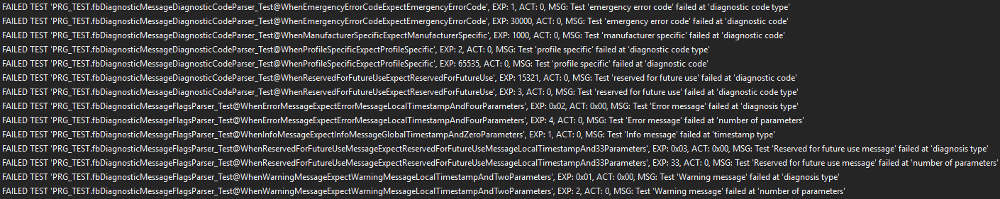

This is just a selection of all the failed asserts.
For every failed assert, we can see the expected value we should have got in case the implementing code did what it is supposed to do and also the actual value as well as the message that we provided to the assert.
The statistics are printed a little bit further down:

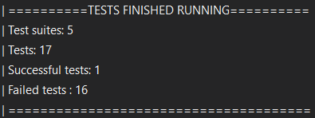

First we can see that we have had five test suites running, in where each had a certain amount of tests defined.
Every test suite is responsible to test a specific function block.
We can see that all tests except one has failed.
But how come that we've had a successful test even though we haven't yet written a single line of code?
This is usually related to tests that test some zero-values, where the default return value of the function block under test is zero.
In this case it is this test:

```StructuredText
METHOD PRIVATE WhenTextIdentityLowExpectTextIdentity0
VAR
    fbDiagnosticMessageTextIdentityParser : FB_DiagnosticMessageTextIdentityParser;
    nTextIdentity : UINT;
 
    // @TEST-FIXTURE TextIdentity#Low
    cnTextIdentityBufferByte1_IdentityLow : BYTE := 16#00; // 0 = no text identity
    cnTextIdentityBufferByte2_IdentityLow : BYTE := 16#00;
    canTextIdentityBuffer_IdentityLow : ARRAY[1..2] OF BYTE := [cnTextIdentityBufferByte1_IdentityLow,
                                                                cnTextIdentityBufferByte2_IdentityLow];
    // @TEST-RESULT TextIdentity#Low
    cnTextIdentity_IdentityLow : UINT := 0;
END_VAR
```

We're testing the function block `FB_DiagnosticMessageTextIdentityParser` by providing it with a zero-value as input (two bytes, each holding `0x00`) and expecting the number 0 as result.
The default initialization of a number value in TwinCAT is always zero, and thus this is returned which makes our test succeed.
Tests that pass without implementing code generally don't provide much value.

## Implementation

Now that we've finalized our unit tests, we have created the acceptance criteria for the expected functionality for our function blocks.
Now it's time to do the actual implementation of the function blocks that we've described.
As we have our unit tests finished, we can anytime during our development run them and check whether the implemented code passes the tests.

We'll start with two of the five function blocks which will provide us the parsing functionality for IO-Link events.

### FB_DiagnosticMessageDiagnosticCodeParser

The diagnosis code looks like this:

| Diagnosis code | |
| - | - |
|Bit 0-15|Bit 16-31|
|0x0000-0xDFFF|not used|
|0xE000-0xE7FF|can be used manufacturer specific|
|0xE800|Emergency Error Code as defined in DS301 or DS4xxx|
|0xE801-0xEDFF|reserved for future standardization|
|0xEE00-0xEFFF|Profile specific|
|0xF000-0xFFFF|not used|

Our function block receives four bytes and should output a data structure of type `ST_DiagnosticCode`, which includes the two data fields `eDiagnosticCodeType` and `nCode`, for each pair of bytes in the table.

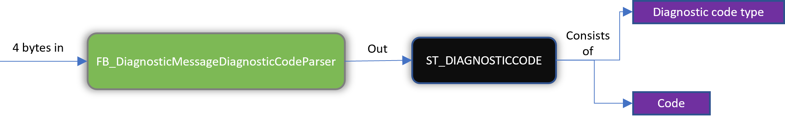

Again, a reminder from before:

```StructuredText
FUNCTION_BLOCK FB_DiagnosticMessageDiagnosticCodeParser
VAR_INPUT
    anDiagnosticCodeBuffer : ARRAY[1..4] OF BYTE;
END_VAR
VAR_OUTPUT
    stDiagnosticCode : ST_DIAGNOSTICCODE;
END_VAR
```

We'll start with the "diagnostic code type".
As shown in the table, these are the two low bytes.
We need to convert these two bytes into a 16-bit `WORD`.
Then we need to compare this word to some constants to know whether the diagnostic code type is "ManufacturerSpecific", "EmergencyErrorCodeDS301", "ProfileSpecific" or "Unspecified".
The table above tells us that:

- There is an unused range between `0x0000-0xDFFF` and another one between `0xF000-0xFFFF`
- There is a range reserved for the future, between `0xE801` and `0xEDFF`

If our `WORD` is in between these ranges, we can set the diagnostic code type to "Unspecified".

The table also tells us that:

- The value for "EmergencyErrorCodeDS301" is `0xE800`
- The range for "ProfileSpecific" is `0xEE00-0xEFFF`
- The range for "ManufacturerSpecific" is `0xE000-0xE7FF`

This gives us enough of information to do a start of the implementation:

```StructuredText
VAR
    nDiagnosisCodeType : WORD;
    nDiagnosisCodeTypeLow : WORD;
    nCode : WORD;
    nCodeLow : WORD;
END_VAR
VAR CONSTANT
    cnNotUsedOne_Low : WORD := 16#0000;
    cnNotUsedOne_High : WORD := 16#DFFF;
    cnManufacturerSpecific_Low : WORD := 16#E000;
    cnManufacturerSpecific_High : WORD := 16#E7FF;
    cnEmergencyErrorCodeDS301 : WORD := 16#E800;
    cnReservedForFutureStandardization_Low : WORD := 16#E801;
    cnReservedForFutureStandardization_High : WORD := 16#EDFF;
    cnProfileSpecific_Low : WORD := 16#EE00;
    cnProfileSpecific_High : WORD := 16#EFFF;
    cnNotUsedTwo_Low : WORD := 16#F000;
    cnNotUsedTwo_High : WORD := 16#FFFF;
END_VAR
```

Here we're preparing with some variables for the parsing, and also the constants that constitute the fixed information in the table.

Going to the body we want to convert the two bytes into a 16-bit `WORD`.
This can be accomplished by:

1. Taking the higher byte, converting it into a word and then shifting the bits 8 positions to the left using the [SHL-operator](https://infosys.beckhoff.com/english.php?content=../content/1033/tc3_plc_intro/9007201783675531.html&id=).
2. Taking the lower byte and doing an OR-operation of it together with the above word

The result will be a `WORD` with the diagnostic code type, which we'll be able to compare with our constants.
For the diagnostic code itself, we'll do exactly the same thing, i.e. take the two bytes (in the correct order) and convert it into a word.
The end result for the body:

```StructuredText
nDiagnosisCodeType := BYTE_TO_WORD(anDiagnosticCodeBuffer[2]);
nDiagnosisCodeType := SHL(nDiagnosisCodeType, 8);
nDiagnosisCodeTypeLow := BYTE_TO_WORD(anDiagnosticCodeBuffer[1]);
nDiagnosisCodeType := nDiagnosisCodeType OR nDiagnosisCodeTypeLow;
 
IF (nDiagnosisCodeType >= cnNotUsedOne_Low AND nDiagnosisCodeType <= cnNotUsedOne_High) OR
   (nDiagnosisCodeType >= cnReservedForFutureStandardization_Low AND
    nDiagnosisCodeType <= cnReservedForFutureStandardization_High) OR
   (nDiagnosisCodeType >= cnNotUsedTwo_Low AND nDiagnosisCodeType <= cnNotUsedTwo_High) THEN
   stDiagnosticCode.eDiagnosticCodeType := E_DIAGNOSTICCODETYPE.Unspecified;
ELSIF nDiagnosisCodeType >= cnManufacturerSpecific_Low AND nDiagnosisCodeType <= cnManufacturerSpecific_High THEN
    stDiagnosticCode.eDiagnosticCodeType := E_DIAGNOSTICCODETYPE.ManufacturerSpecific;
ELSIF nDiagnosisCodeType = cnEmergencyErrorCodeDS301 THEN
    stDiagnosticCode.eDiagnosticCodeType := E_DIAGNOSTICCODETYPE.EmergencyErrorCodeDS301;
ELSIF nDiagnosisCodeType >= cnProfileSpecific_Low AND nDiagnosisCodeType <= cnProfileSpecific_High THEN
    stDiagnosticCode.eDiagnosticCodeType := E_DIAGNOSTICCODETYPE.ProfileSpecific;
END_IF
 
nCode := BYTE_TO_WORD(anDiagnosticCodeBuffer[4]);
nCode := SHL(nCode, 8);
nCodeLow := BYTE_TO_WORD(anDiagnosticCodeBuffer[3]);
nCode := nCode OR nCodeLow;
 
stDiagnosticCode.nCode := WORD_TO_UINT(nCode);
```

Now that we have a finished implementation we can run our tests!
Running our unit tests from earlier will give us the following results:


When this guide was written the implementing code was done in several steps.
First one or two of the tests passed, then by rewriting and refactoring the code all tests eventually passed.
This is the usual workflow.
There are rare occasions when the code works the first time and all tests pass at the first try.
But that's the whole point of test driven development!
With our unit tests we can run the tests anytime we want.
We'll write and compile the code until the tests eventually pass!
A recommendation is to write the code in such a way that the tests pass, and once this is done you can refactor the code so it looks nice as well (and of course re-running the tests to be sure they are still passing).

### FB_DiagnosticMessageFlagsParser

The flags looks like this:

| Flags | |
| - | - |
|Bit 0-3|0: Info message,1: Warning message, 2: Error message, 3-15: Reserved for future use
|Bit 4|Time stamp is a local time stamp.|
|Bit 5-7|Reserved for future use|
|Bit 8-15|Number of parameters in this diagnosis message|

Our function block receives two bytes and should output a data structure of type `ST_Flags`, which includes the three data fields `eDiagnosisType`, `eTimeStampType` and `nNumberOfParametersInDiagnosisMessage`.

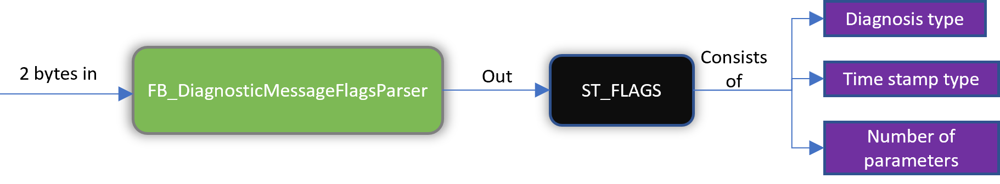

A reminder from before shows how the function block header for this FB looks like:

```StructuredText
FUNCTION_BLOCK FB_DiagnosticMessageFlagsParser
VAR_INPUT
    anFlagsBuffer : ARRAY[1..2] OF BYTE;
END_VAR
VAR_OUTPUT
    stFlags : ST_FLAGS;
END_VAR
VAR
    nFlags : BYTE;
END_VAR
```

In these two bytes we have the three parameters "Diagnosis type", "Timestamp type" and "Number of parameters" stored.
Writing the implementing code (function block body) this is the result:

```StructuredText
nFlags.0 := anFlagsBuffer[1].0;
nFlags.1 := anFlagsBuffer[1].1;
nFlags.2 := anFlagsBuffer[1].2;
nFlags.3 := anFlagsBuffer[1].3;
 
IF nFlags >= 10#0 AND nFlags <= 10#2 THEN
    stFlags.eDiagnosisType := nFlags;
ELSE
    stFlags.eDiagnosisType := E_DIAGNOSISTYPE.Unspecified;
END_IF
 
IF anFlagsBuffer[1].4 THEN
    stFlags.eTimeStampType := E_TIMESTAMPTYPE.Local;
ELSE
    stFlags.eTimeStampType := E_TIMESTAMPTYPE.Global;
END_IF
 
stFlags.nNumberOfParametersInDiagnosisMessage := BYTE_TO_USINT(anFlagsBuffer[2]);
```

**Diagnosis type**  
The diagnosis types are the four first bits of the first byte.
We need to create a temporary variable where we can store our intermediate result.
We'll call this variable nFlags and the datatype is `BYTE`.
We store the first four bits from the first byte in this temporary variable.
Next we'll check that the value provided by these four bits are within the range of the `E_DIAGNOSISTYPE`-enumeration.
If it is so, we can map the received value to the enumerated value. If not, we set the value to "Unspecified".

**Timestamp type**  
If the fifth bit of the first byte is high, the timestamp is local, otherwise it's global.

**Number of parameters in diagnosis message**  
This is the whole second byte to be parsed, so we just convert the byte to an `USINT`.

With a finished implementation we can run our tests, and the result is:

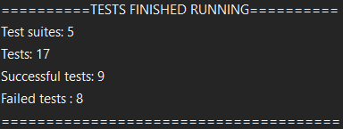

An additional four tests succeeded, which is the amount of tests that we had written for this particular function block.
Now the amount of failed asserts is just getting lower and lower.
It's worth pointing out that it's a good idea to do a quick implementation of parts of the expected functionality so that only parts of the tests succeed before moving on, eventually resulting in all tests succeeding.

The remaining function blocks to implement are:

- `FB_DiagnosticMessageTextIdentityParser`
- `FB_DiagnosticMessageTimeStampParser`
- `FB_DiagnosticMessageParser`

### FB_DiagnosticMessageTextIdentityParser

This one is easy.
We get two bytes in, and we convert those to an 16-bit unsigned integer.


A reminder of what the function block header looks like:

```StructuredText
FUNCTION_BLOCK FB_DiagnosticMessageTextIdentityParser
VAR_INPUT
    anTextIdentityBuffer : ARRAY[1..2] OF BYTE;
END_VAR
VAR_OUTPUT
    nTextIdentity : UINT;
END_VAR
```

What we can do is to first convert the two bytes into a `WORD` using the function `WORD_FROM_BYTES()`.
This function takes two bytes in, and delivers a `WORD` as a result.
The next step is to convert the `WORD` to an `UINT` by simple 61131-3 type-conversion. For the body, only one line of code is necessary.

```StructuredText
nTextIdentity := WORD_TO_UINT(F_WORDFromBytes(B1 := anTextIdentityBuffer[2], B0 := anTextIdentityBuffer[1]));
```

Running our three unit tests that we defined earlier we get the result:

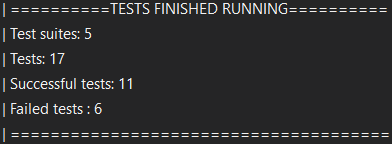

Two additional tests that succeed.

### FB_DiagnosticMessageTimeStampParser

The timestamp parser takes an EtherCAT distributed clock (DC) timestamp (8 bytes), information of whether the timestamp is a local or global timestamp and delivers a human-readable string as output.


A reminder of what the function block header looks like:

```StructuredText
FUNCTION_BLOCK FB_DiagnosticMessageTimeStampParser
VAR_INPUT
    anTimeStampBuffer : ARRAY[1..8] OF BYTE;
    bIsLocalTime : BOOL;
END_VAR
VAR_OUTPUT
    sTimeStamp : STRING(29);
END_VAR
VAR
    nDCTime64 : LWORD;
    nDCTime64HighPart : DWORD;
    nDCTime64LowPart : DWORD;
END_VAR
```

As we decided in part 2, if the diagnosis event timestamp is based on a local clock, we'll just use the current task DC-time (available by using the Beckhoff function [`F_GetCurDcTaskTime64()`](https://infosys.beckhoff.com/english.php?content=../content/1033/tcplclib_tc2_ethercat/2268414091.html&id=) located inside the `Tc2_EtherCAT` library).
If the diagnosis event timestamp is global, we'll use the timestamp that is stored in these 8 bytes.
We need to have a local variable where we can store our intermediate result.
We'll call this variable `nDCTime64` and the type will be `LWORD`.
Once we have the timestamp stored in this variable we can convert it into a 29-character string again using a standard Beckhoff function, [`DCTIME64_TO_STRING()`](https://infosys.beckhoff.com/english.php?content=../content/1033/tcplclib_tc2_ethercat/2267406347.html&id=).
The end result:

```StructuredText
nDCTime64HighPart := F_DWORDFromBytes(B3 := anTimeStampBuffer[8], B2 := anTimeStampBuffer[7],
                                      B1 := anTimeStampBuffer[6], B0 := anTimeStampBuffer[5]);
nDCTime64LowPart := F_DWORDFromBytes(B3 := anTimeStampBuffer[4], B2 := anTimeStampBuffer[3],
                                     B1 := anTimeStampBuffer[2], B0 := anTimeStampBuffer[1]);
nDCTime64 := SHL(DWORD_TO_LWORD(nDCTime64HighPart), 32) OR nDCTime64LowPart;
 
IF nDCTime64 = 0 THEN
    nDCTime64 := F_GetCurDcTaskTime64();
END_IF
 
sTimeStamp := DCTIME64_TO_STRING(in := nDCTime64);
```

The `F_DWORDFromBytes()` function converts four bytes into a `DWORD`.
Running our two unit tests that we defined we get the result:

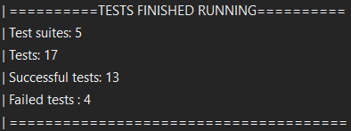

Two additional tests now succeed. Now we only have one function block left to implement!

### FB_DiagnosticMessageParser

This function block uses the other four function blocks to deliver the final result, so running the tests for this one wraps it up.
A reminder from an earlier chapter of what the function block header looks like:

```StructuredText
FUNCTION_BLOCK FB_DiagnosticMessageParser
VAR_INPUT
    anDiagnosticMessageBuffer : ARRAY[1..28] OF BYTE;
END_VAR
VAR_OUTPUT
    stDiagnosticMessage : ST_DIAGNOSTICMESSAGE;
END_VAR
```


This FB needs to instantiate an instance of each and one of the four function blocks that we've created.
Looking at an overview picture:

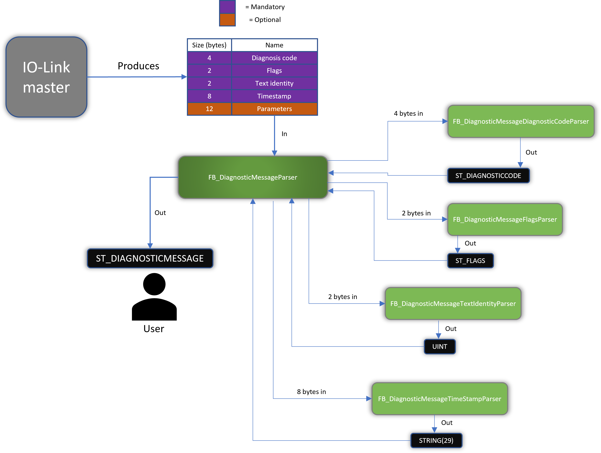

The function block `FB_DiagnosticMessageParser` (dark green in the middle) needs to take the 28 bytes in the correct order and send them to every other function block to get the final result, which is a structure of the type `ST_DIAGNOSTICMESSAGE`.
Again, for this example we only care about the first 4+2+2+8=16 bytes and ignore the last 12 bytes (which are all optional).

We'll add some more variables to the header above now that we know what we want.

```StructuredText
VAR
    anDiagnosticCodeBuffer : ARRAY[1..4] OF BYTE;
    anFlagsBuffer : ARRAY[1..2] OF BYTE;
    anTextIdentityBuffer : ARRAY[1..2] OF BYTE;
    anTimeStampBuffer : ARRAY[1..8] OF BYTE;
    anIOLinkParametersBuffer : ARRAY[1..12] OF BYTE;
 
    fbDiagnosticMessageDiagnosticCodeParser : FB_DiagnosticMessageDiagnosticCodeParser;
    fbDiagnosticMessageFlagsParser : FB_DiagnosticMessageFlagsParser;
    fbDiagnosticMessageTextIdentityParser : FB_DiagnosticMessageTextIdentityParser;
    fbDiagnosticMessageTimeStampParser : FB_DiagnosticMessageTimeStampParser;
END_VAR
```

The four arrays of BYTEs are used as input to the call for all four function blocks.
For the function block body we can do:

```StructuredText
// Parse diagnostic code
anDiagnosticCodeBuffer[1] := anDiagnosticMessageBuffer[1];
anDiagnosticCodeBuffer[2] := anDiagnosticMessageBuffer[2];
anDiagnosticCodeBuffer[3] := anDiagnosticMessageBuffer[3];
anDiagnosticCodeBuffer[4] := anDiagnosticMessageBuffer[4];
fbDiagnosticMessageDiagnosticCodeParser(anDiagnosticCodeBuffer := anDiagnosticCodeBuffer,
                                        stDiagnosticCode => stDiagnosticMessage.stDiagnosticCode);
 
// Parse flags
anFlagsBuffer[1] := anDiagnosticMessageBuffer[5];
anFlagsBuffer[2] := anDiagnosticMessageBuffer[6];
fbDiagnosticMessageFlagsParser(anFlagsBuffer := anFlagsBuffer,
                               stFlags => stDiagnosticMessage.stFlags);
 
// Parse text identity
anTextIdentityBuffer[1] := anDiagnosticMessageBuffer[7];
anTextIdentityBuffer[2] := anDiagnosticMessageBuffer[8];
fbDiagnosticMessageTextIdentityParser(anTextIdentityBuffer := anTextIdentityBuffer,
                                      nTextIdentity => stDiagnosticMessage.nTextIdentityReferenceToESIFile);
 
// Parse time stamp
anTimeStampBuffer[1] := anDiagnosticMessageBuffer[9];
anTimeStampBuffer[2] := anDiagnosticMessageBuffer[10];
anTimeStampBuffer[3] := anDiagnosticMessageBuffer[11];
anTimeStampBuffer[4] := anDiagnosticMessageBuffer[12];
anTimeStampBuffer[5] := anDiagnosticMessageBuffer[13];
anTimeStampBuffer[6] := anDiagnosticMessageBuffer[14];
anTimeStampBuffer[7] := anDiagnosticMessageBuffer[15];
anTimeStampBuffer[8] := anDiagnosticMessageBuffer[16];
fbDiagnosticMessageTimeStampParser(anTimeStampBuffer := anTimeStampBuffer,
                                   bIsLocalTime := (stDiagnosticMessage.stFlags.eTimeStampType = E_TIMESTAMPTYPE.Local),
                                   sTimeStamp => stDiagnosticMessage.sTimeStamp);
```

Here we are preparing the input for every function block by copying the correct bytes from the total 28 bytes.
Then we are calling each and one of the four function blocks and store the result in the total output variable (`stDiagnosticMessage`).
Each test prepares various combinations of a diagnosis event message, so that we can test as a big diversity as possible.
Running our test-program `PRG_TEST` and looking at the result of the unit tests for this function block we get:

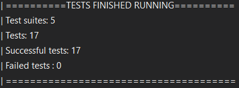

Success!
Again it's important for to point out that at first, these tests failed.
Normally one has to continuously rewrite the code and re-run the tests until all the tests pass.
This is completely normal, and the whole reason you've written the unit tests to start with.
As you have all your unit tests, just run them and you will immediately know whether your code is doing what it's supposed to.

## Final words

There are some final words that should be mentioned in relation to this example.
What's important to note here is that we managed to develop a lot of working software just by reading specifications.
We haven't yet had any need for any hardware, but even so we can still with high confidence say things are going to work.
By making sure that we want to test only very small pieces of functionality at a time, we have designed a highly modularized pieces of software where each function block only does a small thing, but where they together implement an important part of the functionality of IO-Link.
The large amount of test code that we have produced now also acts as excellent documentation for any other developer reading your code.
If it's hard to understand what a specific function block is supposed to do, just take a look at the test code for some excellent documentation.

The final test of that the software is actually working is of course to run in on real hardware.
In [this blog post](https://sagatowski.com/posts/test_driven_development_in_twincat_part_7/) this is described, running the software on various IO-Link masters supporting the diagnosis history object.

We are at the end of this programming example, and this is a good opportunity to go through some of the gains that we achieve by writing our software using test driven development together with an unit testing framework.

**Documentation**  
Writing all this test code has resulted in some really good documentation for the software.
Simply by looking at the tests it is easy to understand what the actual software is supposed to do.
The test cases that we wrote dictate what outputs every function block should provide given a set of inputs.
With this information, any developer that looks at the test cases gets a better understanding of what the function block is supposed to do, so the test cases become examples of what the code should do.

**Fewer bugs**  
Because we can write as many test cases as we want for our code, we achieve better test coverage.
We're not only limited on what tests we can do with any hardware, but can throw any test scenario at our code.
We can test all those extreme edge cases having higher code coverage.
Because we have better code coverage, we will have fewer bugs.

**Regression test-suite**  
We can at any point run our tests and see that all tests still succeed.
At some point or another we will need to do changes in the software, for instance if we want add new functionality.
Doing changes in software can make anyone nervous, but because we have our tests we can with significantly higher confidence do any changes.
Simply run the tests again and see that nothing has broken.

**Acceptance criteria**  
When developing a certain set of functionalities, it's necessary to define what that functionality is supposed to provide.
With unit test cases, this is exactly what is done and thus these test cases become the acceptance criteria of the software.

**Clear defined interfaces**  
When defining the tests, you'll automatically define what the function blocks under test should provide, and thus you'll end up with clear defined interfaces for the function blocks.
The unit tests won't just be software for validating the application, but will also be an engine for the design of the software.

**Modularized code**  
Once you've written tests for a time, it gets natural to test small sets of functionalities at a time, and thus your function blocks usually end up quite small.
Adhering to test driven development thus leads to more modularized, extensible, and flexible code.
