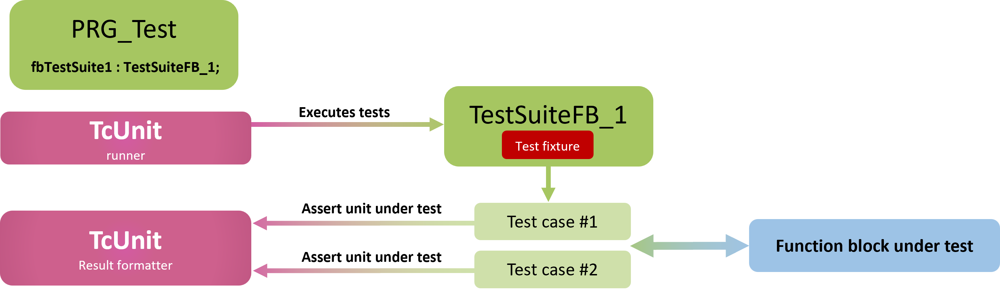
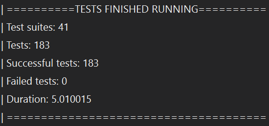

# Unit testing concepts

This page briefly describes test driven development in general, and some basic concepts of unit testing with TcUnit in particular.

- [Test driven development](#test-driven-development)
- [Unit testing with TcUnit](#unit-testing-with-tcunit)

## Test driven development
Test driven development (TDD) is the practice of writing a test for some required functionality, before writing any implementation code.
The idea is that when you run your tests the first time, they will fail.
After you’ve written your (failing) tests, you do the actual implementation, until the tests succeed.
Holding to the TDD discipline means that you don’t fall to the temptation to write tests after the implementation, but before.
In this way, you do your code in iterations as quick as possible, until the code under test passes the tests.
After passing the test, you refactor your code until it holds up to acceptable standards.
When you’ve done this for some time, you naturally write function blocks that are quite small, and which conform to the [SOLID](https://en.wikipedia.org/wiki/SOLID) principles of object oriented programming.
When doing software development, what usually happens when the code base grows is that it gets harder to change the code base as the developer gets scared that some existing functionality might get broken.
One of the properties that these tests have is that you suddenly have a **regression test-suite** of your code.
If you find it necessary to do any changes to the software (for instance, by refactoring or if you want to add functionality), you have all the tests which you easily can re-run.
This increases the programmer’s confidence in making larger architectural changes when adding new functionality.
Once you’ve written tests for a time, it gets natural to test small sets of functionalities at a time, and thus your function blocks usually end up quite small.
TDD thus leads to more **modularized**, **extensible**, and **flexible** code. When defining the tests, you’ll automatically define what the function blocks under tests should provide, and thus you’ll end up with **clear defined interfaces** for the function blocks.
The unit tests shouldn’t just be software for validating the application, but is equally much a mental engine for the design of the software.

As you’re writing test cases, you get better test code coverage and thus **fewer bugs**.
As your test cases are written, you come up with scenarios and run your code that you normally wouldn’t run under normal test circumstances.
Any developer that is going to look at your code will get **documentation** of what the code is supposed to do looking at the test cases.
The test cases dictate what outputs every function block should provide given a set of inputs.
With this information, any developer that looks at the test cases gets a better understanding of what the function block is supposed to do, so the test cases become examples of what the code should do.
When developing a certain set of functionalities, you need to define what that functionality is supposed to provide.
With unit test cases, this is exactly what we are doing and thus these become **acceptance criteria**.
As every test case that you are writing is for a single piece of functionality, you will have to think what interfaces that functionality needs to provide for the rest of the code to be integrated.
As the test cases are written first, only these interfaces needs to be initially defined.
All the other methods and inner workings of the implementing code can be made private!
This will result in **tidier code**.

Once the tests are in place, and you write your code until the code passes the tests, you’ll sense a feel of accomplishment knowing your code passes the tests.
When you work in a larger project and have thousands of tests that are to be executed, it’s a nice feel to have all the tests pass OK!
Starting with TDD in the beginning will feel like you must double the effort, as you now not only need to write the code itself but also the test cases for them.
First off, what you’re doing is saving time that you will later have to spend fixing all the bugs.
Second, when you’ve done this for a while it doesn’t take so much longer to write some test cases before starting with the implementation.
And on top of that, you get all the other benefits which are mentioned earlier.
It’s the starting ramp-up time to get into the “TDD thinking” that takes the longest.
Writing tests costs time, but overall development takes less time.

## Unit testing with TcUnit
As TcUnit is a xUnit type of framework, and as such has certain components with their respective responsibility.

Let’s go through each and one of them.

### PRG_Test
**PRG_Test** is not part of the framework or the xUnit-concept at all, but is just here to point out that the test cases need an environment to run in.
They need to be initialized.
The program that will execute the tests will never be executed in a production environment, and is only here for the sole purpose of running the unit tests.
It can either be included directly in your library projects or as a completely separate solution.

### Test case
A test case is the most rudimentary building block.
It is defined by a name that describes the intention of the test and the expected result.

### Test fixture
A test fixture is the set of preconditions or state needed to run a test.
In TcUnit these can typically be some constant variables that are used as input for a function block under test.
In TcUnit these can be declared in the test suite or in the test case, depending on whether you want them to be shared across several tests or not.

### Test suite
A test suite is a collection of tests related to each other.
In TcUnit they can share the same test fixture, but there is also a possibility to have a separate test fixture for each test in a test suite.
In TcUnit a test suite is defined as a function block.

### Assertions
An assertion is a method that verifies some state of the unit under test.
If you for instance want to verify that a boolean output of a function block is according to a certain state, you can assert that the output is true.
There are many various assert-methods in TcUnit, depending on the data type that holds the state.
Some examples are `AssertEquals_INT`, `AssertEquals_STRING` and `AssertEquals_BOOL`.

### Test result formatter
This is a part that produces the end result of the test, that for instance can be used for a human to read.

### Test runner
The test runner of TcUnit makes sure to run all the tests defined and collect the results from them.